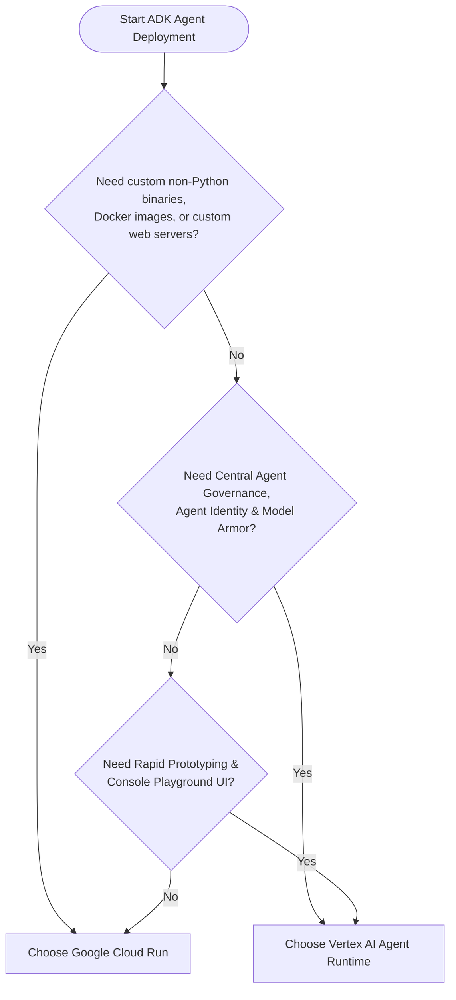

# Choosing the Right Deployment Path for Google ADK Agents

Deploying agents built with the **Google Agent Development Kit (ADK)** requires selecting an infrastructure runtime that aligns with your operational complexity, security posture, networking needs, and governance requirements.

With the evolution of the **Gemini Enterprise Agent Platform**, Google Cloud offers two primary modern deployment paths for ADK agents:

1. **Vertex AI Agent Runtime (Reasoning Engines)** — A purpose-built, serverless AI agent runtime natively integrated with Gemini Enterprise governance, Agent Identity, Agent Gateway, and Agent Registry.
2. **Google Cloud Run** — A versatile, general-purpose serverless container platform offering complete control over container images, web servers, custom runtimes, and VPC networking.

---

## 📊 Comprehensive Comparison Matrix (Latest Capabilities)

| Evaluation Dimension | Vertex AI Agent Runtime (Reasoning Engines) | Google Cloud Run |
| :--- | :--- | :--- |
| **Primary Paradigm** | **Managed AI Agent-as-a-Service** (Code-to-Agent via SDK) | **General-Purpose Serverless Containers** (OCI / Docker) |
| **Target Runtime Model** | Python-first (`reasoning_engines.AdkApp` / Python objects) | Any language / container (Python, Go, TypeScript, Java) |
| **Deployment Mechanism** | `client.agent_engines.create(agent=..., config=...)` or Vertex SDK | `gcloud run deploy` / Cloud Build / CI/CD Docker pipelines |
| **Machine Identity & Zero Trust** | **Native Agent Identity (`AGENT_IDENTITY`)**<br>Cryptographic, per-agent instance SPIFFE IDs (`principal://agents...`) | **GCP Service Accounts (IAM)**<br>Assigned at the Cloud Run service revision level |
| **Egress Governance & Policy** | **Native Agent Gateway Integration** (`agent_gateway_config`)<br>Egress through mTLS with IAP Authz policies, Model Armor & audit logs | **Manual / Network-Level**<br>Requires VPC Direct Egress, Cloud NAT, Secure Web Proxy, or custom API gateways |
| **Ingress Control & Discovery** | **Native Agent Registry Registration**<br>Exposes mTLS / JSON-RPC / REST interfaces for dynamic A2A discovery | **Cloud Run URLs / Service Directory**<br>Standard IAM authentication or Cloud Run custom domains / internal ALB |
| **Agent-to-Agent (A2A) Routing** | **Automated Zero-Trust A2A**<br>Propagates caller machine identity across spoke projects via Agent Gateway | **Service-to-Service IAM**<br>Caller Cloud Run SA invokes target Cloud Run URL with OIDC identity token |
| **Security Guardrails** | **Integrated Model Armor & IAP Policies**<br>Pre/post-call prompt sanitization and role-based tool authorization | **Custom Application Logic**<br>Model Armor API must be called explicitly inside application middleware |
| **Session & State Management** | **Vertex AI Session Service & Memory Banks**<br>In-memory or fully managed persistent session storage via ADK | **External State Store**<br>Requires managed Firestore, Memorystore (Redis), Cloud SQL, or Spanner |
| **Observability & Telemetry** | **One-Click Cloud Trace & Telemetry**<br>Native OpenTelemetry integration toggled via environment variables or UI | **Custom Tracing Instrumentation**<br>Requires manual OpenTelemetry SDK setup and Cloud Trace exporter |
| **Networking & Private Access** | **Private Service Connect Interface (PSC-I)**<br>Isolated container runtime with controlled egress through Agent Gateway | **Direct VPC Egress / Serverless VPC Access**<br>Full private RFC 1918 VPC routing, internal ALBs, and Cloud Armor |
| **Scale-to-Zero & Cold Starts** | Fully managed scaling with pre-warmed Agent Runtime workers | Standard Cloud Run cold start (min instances configurable) |
| **Interactive Testing** | **Native Cloud Console Playground**<br>Interactive chat UI with streaming `:streamQuery` support | Requires custom frontend, Swagger/OpenAPI UI, or curl scripts |

---

## 🔍 Deep-Dive Architecture Comparison

### 1. Identity & Zero-Trust Security

* **Vertex AI Agent Runtime**:
  * Employs **Agent Identity** (`identity_type: "AGENT_IDENTITY"`), minting a unique SPIFFE identity for each specific deployed reasoning engine instance:
    ```
    principal://agents.global.org-1015654926499.system.id.goog/resources/aiplatform/projects/<PROJECT_NUM>/locations/<REGION>/reasoningEngines/<ENGINE_ID>
    ```
  * Downstream tool providers and specialist agents can enforce granular IAM bindings specifically for that reasoning engine without granting broad project-level service account permissions.

* **Cloud Run**:
  * Uses standard **Compute Service Accounts**. All requests emitted from any revision of the service share the same Service Account identity, making fine-grained inter-agent authorization dependent on role delegation or custom token exchange.

---

### 2. Tool & Egress Governance (Agent Gateway & Model Armor)

* **Vertex AI Agent Runtime**:
  * Configured with `agent_gateway_config` (`agent_to_anywhere_config`), automatically routing all outbound external tool requests, MCP servers, and specialist agent calls through a centralized **Agent Gateway**.
  * Enables security teams to enforce **Identity-Aware Proxy (IAP) Egress Authorization**, inspection with **Model Armor** (preventing prompt injections and data leaks), and centralized audit logging without altering application code.

* **Cloud Run**:
  * Outbound traffic reaches the internet or VPC directly. Enforcing centralized security inspection requires configuring VPC Direct Egress to route through dedicated egress appliances, Cloud Next-Generation Firewalls (NGFW), or third-party proxies.

---

### 3. Agent-to-Agent (A2A) Multi-Project Orchestration

* **Vertex AI Agent Runtime**:
  * Works natively with **Agent Registry**. Orchestrators (such as a Purchasing Concierge) query the registry to discover specialist agents (e.g., Pizza and Burger sellers) across projects and communicate via cross-project mTLS JSON-RPC endpoints.
  * Identity is propagated automatically across project boundaries.

* **Cloud Run**:
  * Multi-agent architectures are implemented as standard microservice clusters. Agents communicate over HTTPS using Google ID tokens (`Authorization: Bearer $(gcloud auth print-identity-token)`), requiring DNS configuration, Service Directory, or API Gateway setup.

---

### 4. State, Session, and Memory Banks

* **Vertex AI Agent Runtime**:
  * Supports built-in session storage (`InMemorySessionService` or `VertexAiSessionService`) and Vertex AI **Memory Banks** for long-term memory retrieval and user context across interactions.

* **Cloud Run**:
  * Stateless by default. Developers must explicitly integrate external database services (Firestore, Memorystore for Redis, or AlloyDB) for conversational history and session locks.

---

## 🎯 Which Deployment Path Should You Choose?



### Choose **Vertex AI Agent Runtime** if:
* You are building an enterprise multi-agent ecosystem that requires **Agent Identity (SPIFFE)** and **Agent Gateway** governance.
* You need dynamic tool discovery and A2A routing via **Agent Registry**.
* You want turnkey **OpenTelemetry tracing**, **Console Playground UI**, and managed session persistence without building infrastructure plumbing.
* Your agent codebase is Python-centric and leverages Google ADK or LangChain/CrewAI primitives.

### Choose **Google Cloud Run** if:
* You require non-Python runtimes (e.g., Go, TypeScript, Java) or custom OS packages and compiled binaries.
* You require custom API frameworks (e.g., custom FastAPI, gRPC services, WebSocket servers, or custom health endpoints).
* You require direct internal RFC 1918 VPC routing to on-premises networks without passing through the Agent Platform.
* Your organization already has mature Docker container CI/CD pipelines and Kubernetes-style container operations.
