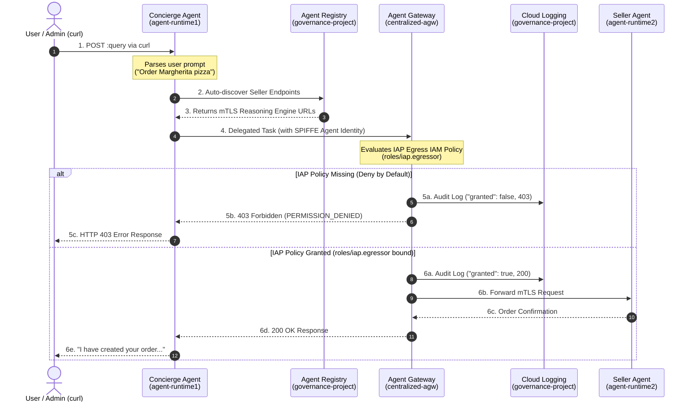

# Governance for Cross-Project Agent-to-Agent (A2A) Communication with Agent Gateway and Agent Registry

## 1. Introduction
duration: 5

This Codelab explores enterprise cross-project **Agent-to-Agent (A2A)** governance and dynamic autodiscovery using **Gemini Enterprise Agent Platform** components: **Agent Gateway**, **Agent Registry**, and **Agent Identity**.

In a multi-tenant enterprise architecture across **three projects**, agents run in isolated runtime projects while requiring centralized governance, fine-grained access control, and dynamic service discovery.

> [!NOTE]
> **Architecture Best Practice Note**:
> In production enterprise deployments, using a **Shared VPC** with Private Service Connect (PSC) network attachments is the recommended method for Agent Centralization to enforce private network boundary isolation. However, the primary goal of this codelab is to demonstrate **cross-project governance, Identity-Aware Proxy (IAP) access control policies, and dynamic Agent Registry auto-discovery**. To focus on governance without networking overhead, this codelab uses a streamlined 3-project setup.

```
+---------------------------------------------------+---------------------------------------------------+
|                                                   |                                                   |
|   PURCHASING RUNTIME PROJECT                      |               SELLER RUNTIME PROJECT              |
|        (agent-runtime1)                           |                  (agent-runtime2)                 |
|                                                   |                                                   |
|  +---------------------------------------------+  |  +---------------------------------------------+  |
|  |         Purchasing Concierge Agent          |  |  |     Burger Agent     |   Pizza Agent          |  |
|  |         (Identity: AGENT_IDENTITY)          |  |  |   (Seller Agent)     | (Seller Agent)         |  |
|  +----------------------+----------------------+  |  +----------------------+----------------------+  |
|                         |                         |                         ^                         |
+-------------------------|-------------------------+-------------------------|-------------------------+
                          | (Egress via AGW)                                  | (Target Reasoning Engines)
                          v                                                   |
+-----------------------------------------------------------------------------|-------------------------+
|                                  CENTRAL GOVERNANCE PROJECT                 |                         |
|                               (centralized-governance-project)              |                         |
|                                                                             |                         |
|  +--------------------------------------------------------------------------+----------------------+  |
|  |                             Central Agent Gateway (centralized-agw)                             |  |
|  +--------------------------------------------------+----------------------------------------------+  |
|                                                     |                                                 |
|  +--------------------------------------------------v----------------------------------------------+  |
|  |                                    Central Agent Registry                                       |  |
|  |  +------------------------------------------+  +---------------------------------------------+  |  |
|  |  |  Purchasing Concierge Agent              |  |  | Burger Agent (ALLOW)| Pizza Agent (BLOCK)  |  |  |
|  |  +------------------------------------------+  +---------------------------------------------+  |  |
|  +-------------------------------------------------------------------------------------------------+  |
+-------------------------------------------------------------------------------------------------------+
```

### What you build
In this codelab, you will:
- Deploy a **Centralized Agent Gateway** (`centralized-agw`) in `AGENT_TO_ANYWHERE` egress mode in `centralized-governance-project`.
- Deploy specialist **Burger Seller Agent** and **Pizza Seller Agent** in the `agent-runtime2` project.
- Deploy the **Purchasing Concierge Agent** in the `agent-runtime1` project.
- Manually register all three agents (`purchasing-concierge-adk`, `burger-seller-agent`, `pizza-seller-agent`) in the **Central Agent Registry** (`centralized-governance-project`).
- Enforce **Identity-Aware Proxy (IAP) Egress Policies** using `gcloud beta iap web`:
  - **ALLOW** policy: Grant the Purchasing Concierge permission to invoke the Burger Agent.
  - **BLOCK** policy: Deny/omit permission for the Purchasing Concierge to invoke the Pizza Agent.
- Perform end-to-end testing to verify that Burger calls succeed and Pizza calls are blocked by Agent Gateway with `HTTP 403 Forbidden`.

### What you learn
- How to configure cross-project service agent IAM permissions for centralized gateways.
- How to route Vertex AI Agent Runtime egress through a central Agent Gateway across multi-project environments.
- How to use SPIFFE-based **Agent Identity** (`types.IdentityType.AGENT_IDENTITY`) for fine-grained governance.
- How to manually register agents in Agent Registry (`gcloud agent-registry services create ... --agent-spec-type=no-spec`).
- How to configure IAP Egress policies on Agent Registry resources using `gcloud beta iap web add-iam-policy-binding` with `--agent` resource scope.

---

## 2. Setup and Requirements
duration: 5

### Environment Variables
To make this codelab completely portable and reusable across environments, we define variable names for all project IDs, regions, and resources across the **three required projects**. **Do not hardcode project IDs or regions.**

Set the environment variables in your terminal:

```bash
# 1. Centralized Governance Project (Gateway & Registry)
export GOOGLE_CLOUD_PROJECT_GOVERNANCE="centralized-governance-project"

# 2. Concierge Runtime Project (Purchasing Concierge Agent)
export GOOGLE_CLOUD_PROJECT_CONCIERGE="agent-runtime1"

# 3. Sellers Runtime Project (Burger & Pizza Seller Agents)
export GOOGLE_CLOUD_PROJECT_SELLERS="agent-runtime2"

# 4. Regional & Gateway Settings
export REGION="us-central1"
export GATEWAY_NAME="centralized-agw"
```

### Get Project Numbers
Retrieve and store the project numbers required for IAM bindings:

```bash
export PROJECT_NUMBER_GOVERNANCE=$(gcloud projects describe $GOOGLE_CLOUD_PROJECT_GOVERNANCE --format="value(projectNumber)")
export PROJECT_NUMBER_CONCIERGE=$(gcloud projects describe $GOOGLE_CLOUD_PROJECT_CONCIERGE --format="value(projectNumber)")
export PROJECT_NUMBER_SELLERS=$(gcloud projects describe $GOOGLE_CLOUD_PROJECT_SELLERS --format="value(projectNumber)")

echo "Governance Project Number: $PROJECT_NUMBER_GOVERNANCE"
echo "Concierge Project Number:  $PROJECT_NUMBER_CONCIERGE"
echo "Sellers Project Number:    $PROJECT_NUMBER_SELLERS"
```

### Enable Required Google Cloud APIs
Enable the necessary APIs across your projects:

```bash
# Governance Project APIs
gcloud services enable \
  networkservices.googleapis.com \
  agentregistry.googleapis.com \
  iap.googleapis.com \
  aiplatform.googleapis.com \
  --project=$GOOGLE_CLOUD_PROJECT_GOVERNANCE

# Concierge Project APIs
gcloud services enable \
  aiplatform.googleapis.com \
  storage.googleapis.com \
  --project=$GOOGLE_CLOUD_PROJECT_CONCIERGE

# Sellers Project APIs
gcloud services enable \
  aiplatform.googleapis.com \
  storage.googleapis.com \
  --project=$GOOGLE_CLOUD_PROJECT_SELLERS
```

### Register Core Google APIs Endpoint Service
Agent Gateway requires Google API URLs to be registered in the Agent Registry so that agents can egress traffic securely to core Google Cloud services (such as Vertex AI, IAM Credentials, and Telemetry):

```bash
gcloud agent-registry services create core-gapi-services \
  --project=$GOOGLE_CLOUD_PROJECT_GOVERNANCE \
  --location=$REGION \
  --display-name="gapi.core.services" \
  --description="core apis and services" \
  --endpoint-spec-type=no-spec \
  --interfaces=protocolBinding=JSONRPC,url=https://telemetry.googleapis.com \
  --interfaces=protocolBinding=JSONRPC,url=https://telemetry.mtls.googleapis.com \
  --interfaces=protocolBinding=JSONRPC,url=https://${REGION}-aiplatform.googleapis.com \
  --interfaces=protocolBinding=JSONRPC,url=https://${REGION}-aiplatform.mtls.googleapis.com \
  --interfaces=protocolBinding=JSONRPC,url=https://cloudresourcemanager.googleapis.com \
  --interfaces=protocolBinding=JSONRPC,url=https://iamcredentials.googleapis.com \
  --interfaces=protocolBinding=JSONRPC,url=https://iamcredentials.mtls.googleapis.com \
  --interfaces=protocolBinding=JSONRPC,url=https://agentregistry.googleapis.com
```

### Grant Egress Access for Core Google APIs Endpoint
Grant organization-wide (or project-wide) `roles/iap.egressor` permissions so that all agents routing through Agent Gateway can communicate with core Google APIs:

```bash
# 1. Get Organization ID
export ORGANIZATION_ID=$(gcloud projects describe $GOOGLE_CLOUD_PROJECT_GOVERNANCE --format="value(parent.id)")

# 2. Extract core-gapi-services Endpoint ID
export CORE_GAPI_ENDPOINT_ID=$(gcloud agent-registry services describe core-gapi-services \
  --project=$GOOGLE_CLOUD_PROJECT_GOVERNANCE \
  --location=$REGION \
  --format="value(registryResource)" | awk -F'/' '{print $NF}')

# 3. Grant IAP Egressor Policy
gcloud beta iap web add-iam-policy-binding \
  --resource-type=agent-registry \
  --endpoint=$CORE_GAPI_ENDPOINT_ID \
  --region=$REGION \
  --project=$GOOGLE_CLOUD_PROJECT_GOVERNANCE \
  --role="roles/iap.egressor" \
  --member="principalSet://agents.global.org-${ORGANIZATION_ID}.system.id.goog/*"
```

---

## 3. Deploy Centralized Agent Gateway
duration: 10

Deploy the centralized Agent Gateway (`centralized-agw`) in `AGENT_TO_ANYWHERE` egress mode inside the `$GOOGLE_CLOUD_PROJECT_GOVERNANCE` project.

### Step 1: Define Gateway Configuration Manifest
Create `agw-centralized.yaml`:

```bash
cat <<EOF > agw-centralized.yaml
name: ${GATEWAY_NAME}
protocols:
  - MCP
googleManaged:
  governedAccessPath: AGENT_TO_ANYWHERE
registries:
  - projects/${GOOGLE_CLOUD_PROJECT_GOVERNANCE}/locations/${REGION}
EOF

# Deploy Centralized Agent Gateway
gcloud alpha network-services agent-gateways import ${GATEWAY_NAME} \
  --project=${GOOGLE_CLOUD_PROJECT_GOVERNANCE} \
  --location=${REGION} \
  --source=agw-centralized.yaml
```

### Step 2: Grant Cross-Project Access to Runtime Service Agents
The Vertex AI service agents in both runtime projects (`$GOOGLE_CLOUD_PROJECT_CONCIERGE` and `$GOOGLE_CLOUD_PROJECT_SELLERS`) require cross-project IAM permissions to inspect the Agent Gateway in `$GOOGLE_CLOUD_PROJECT_GOVERNANCE`:

```bash
# 1. Create Custom IAM Role in Governance Project
gcloud iam roles create ar_agw_cross_project_sa \
  --project=$GOOGLE_CLOUD_PROJECT_GOVERNANCE \
  --title="Runtime Agent Gateway Cross-Project SA" \
  --description="Custom role for Runtime Service Agents to inspect Agent Gateway" \
  --permissions="networkservices.agentGateways.get,networkservices.operations.get"

# 2. Grant Role to Concierge Service Agent
gcloud projects add-iam-policy-binding $GOOGLE_CLOUD_PROJECT_GOVERNANCE \
  --member="serviceAccount:service-${PROJECT_NUMBER_CONCIERGE}@gcp-sa-aiplatform.iam.gserviceaccount.com" \
  --role="projects/${GOOGLE_CLOUD_PROJECT_GOVERNANCE}/roles/ar_agw_cross_project_sa"

# 3. Grant Role to Sellers Service Agent
gcloud projects add-iam-policy-binding $GOOGLE_CLOUD_PROJECT_GOVERNANCE \
  --member="serviceAccount:service-${PROJECT_NUMBER_SELLERS}@gcp-sa-aiplatform.iam.gserviceaccount.com" \
  --role="projects/${GOOGLE_CLOUD_PROJECT_GOVERNANCE}/roles/ar_agw_cross_project_sa"
```

---

## 4. Deploy Seller Agents to agent-runtime2
duration: 15

Deploy both the **Burger Seller Agent** and **Pizza Seller Agent** to Vertex AI Reasoning Engine in `$GOOGLE_CLOUD_PROJECT_SELLERS` (`agent-runtime2`). Both deployments will specify the centralized gateway (`centralized-agw` in `$GOOGLE_CLOUD_PROJECT_GOVERNANCE`) and attach `types.IdentityType.AGENT_IDENTITY`.

### Deploy Seller Agents
```bash
uv run python deploy_sellers_adk.py \
  --project=$GOOGLE_CLOUD_PROJECT_SELLERS \
  --region=$REGION \
  --gateway-name=$GATEWAY_NAME \
  --gateway-project=$GOOGLE_CLOUD_PROJECT_GOVERNANCE
```

> [!NOTE]
> **Understanding Agent Gateway Parameter Resolution**:
> The Python deployment script takes `--gateway-project` (`centralized-governance-project`) and `--gateway-name` (`centralized-agw`) and constructs the full Agent Gateway resource path required by the Vertex AI Agent Engine runtime:
> `projects/centralized-governance-project/locations/us-central1/agentGateways/centralized-agw`

### Extract Reasoning Engine IDs
Upon successful deployment, `deploy_sellers_adk.py` saves the deployed resource IDs into `seller_agents.env`:

```bash
source seller_agents.env
export BURGER_ENGINE_ID=$(echo $BURGER_SELLER_AGENT_ID | awk -F'/' '{print $NF}')
export PIZZA_ENGINE_ID=$(echo $PIZZA_SELLER_AGENT_ID | awk -F'/' '{print $NF}')

echo "Burger Engine ID: $BURGER_ENGINE_ID"
echo "Pizza Engine ID:  $PIZZA_ENGINE_ID"
```

---

## 5. Deploy Purchasing Concierge Agent to agent-runtime1
duration: 10

Deploy the **Purchasing Concierge Agent** to Vertex AI Reasoning Engine in `$GOOGLE_CLOUD_PROJECT_CONCIERGE` (`agent-runtime1`).

```bash
uv run python deploy_concierge_adk.py \
  --project=$GOOGLE_CLOUD_PROJECT_CONCIERGE \
  --region=$REGION \
  --gateway-name=$GATEWAY_NAME \
  --gateway-project=$GOOGLE_CLOUD_PROJECT_GOVERNANCE
```

> [!NOTE]
> **Dynamic Agent Registry Auto-Discovery**:
> The Purchasing Concierge ADK agent dynamically queries the Central Agent Registry in `$GOOGLE_CLOUD_PROJECT_GOVERNANCE` (`GOVERNANCE_PROJECT_ID`) at runtime to auto-discover the registered seller agent endpoints (Pizza Seller Agent and Burger Seller Agent). This eliminates hardcoding agent resource IDs or project numbers, making seller agent discovery completely dynamic.

Extract the Concierge Reasoning Engine ID:
```bash
export CONCIERGE_ENGINE_ID=$(gcloud aiplatform reasoning-engines list \
  --project=$GOOGLE_CLOUD_PROJECT_CONCIERGE \
  --region=$REGION \
  --filter="displayName:purchasing-concierge-adk" \
  --format="value(name)" | awk -F'/' '{print $NF}')

echo "Concierge Engine ID: $CONCIERGE_ENGINE_ID"
```

---

## 6. Manually Register Agents in Central Agent Registry
duration: 10

Register all three agents (`burger-seller-agent`, `pizza-seller-agent`, and `purchasing-concierge-adk`) in the **Central Agent Registry** in `$GOOGLE_CLOUD_PROJECT_GOVERNANCE`.

Using `--agent-spec-type=no-spec` creates a Service resource that Agent Registry automatically projects as a read-only **Agent** resource under `/agents/`.

### Step 1: Register Pizza Seller Agent
```bash
gcloud agent-registry services create pizza-seller-agent \
  --project=$GOOGLE_CLOUD_PROJECT_GOVERNANCE \
  --location=$REGION \
  --display-name="Pizza Seller Agent" \
  --description="Pizza Seller Agent reasoning engine in agent-runtime2" \
  --agent-spec-type=no-spec \
  --interfaces="protocolBinding=JSONRPC,url=https://${REGION}-aiplatform.mtls.googleapis.com/v1/projects/${PROJECT_NUMBER_SELLERS}/locations/${REGION}/reasoningEngines/${PIZZA_ENGINE_ID}"
```

### Step 2: Register Burger Seller Agent
```bash
gcloud agent-registry services create burger-seller-agent \
  --project=$GOOGLE_CLOUD_PROJECT_GOVERNANCE \
  --location=$REGION \
  --display-name="Burger Seller Agent" \
  --description="Burger Seller Agent reasoning engine in agent-runtime2" \
  --agent-spec-type=no-spec \
  --interfaces="protocolBinding=JSONRPC,url=https://${REGION}-aiplatform.mtls.googleapis.com/v1/projects/${PROJECT_NUMBER_SELLERS}/locations/${REGION}/reasoningEngines/${BURGER_ENGINE_ID}"
```

### Step 3: Register Purchasing Concierge ADK Agent
```bash
gcloud agent-registry services create purchasing-concierge-adk \
  --project=$GOOGLE_CLOUD_PROJECT_GOVERNANCE \
  --location=$REGION \
  --display-name="Purchasing Concierge ADK" \
  --description="Purchasing Concierge ADK reasoning engine in agent-runtime1" \
  --agent-spec-type=no-spec \
  --interfaces="protocolBinding=JSONRPC,url=https://${REGION}-aiplatform.mtls.googleapis.com/v1/projects/${PROJECT_NUMBER_CONCIERGE}/locations/${REGION}/reasoningEngines/${CONCIERGE_ENGINE_ID}"
```

### Step 4: Extract Projected Agent Resource IDs
List the registered Agent resources and extract their projected Agent IDs (`agentregistry-...`):

```bash
gcloud alpha agent-registry agents list \
  --project=$GOOGLE_CLOUD_PROJECT_GOVERNANCE \
  --location=$REGION \
  --format="table(displayName, name.basename():label=AGENT_ID, protocols[0].interfaces[0].url)"
```

Extract each Agent ID for IAM policy binding:
```bash
export BURGER_AGENT_ID=$(gcloud alpha agent-registry agents list --project=$GOOGLE_CLOUD_PROJECT_GOVERNANCE --location=$REGION --filter="displayName='Burger Seller Agent'" --format="value(name.basename())")
export PIZZA_AGENT_ID=$(gcloud alpha agent-registry agents list --project=$GOOGLE_CLOUD_PROJECT_GOVERNANCE --location=$REGION --filter="displayName='Pizza Seller Agent'" --format="value(name.basename())")
export CONCIERGE_AGENT_ID=$(gcloud alpha agent-registry agents list --project=$GOOGLE_CLOUD_PROJECT_GOVERNANCE --location=$REGION --filter="displayName='Purchasing Concierge ADK'" --format="value(name.basename())")

echo "Burger Projected Agent ID:    $BURGER_AGENT_ID"
echo "Pizza Projected Agent ID:     $PIZZA_AGENT_ID"
echo "Concierge Projected Agent ID: $CONCIERGE_AGENT_ID"
```

### Step 5: How Concierge Auto-Discovers Agents via Agent Registry REST API
During initialization (`before_agent_callback`), the Purchasing Concierge dynamically queries the Agent Registry REST endpoint in `$GOOGLE_CLOUD_PROJECT_GOVERNANCE` to discover all registered seller agents and their mTLS endpoints without hardcoding resource IDs:

```bash
export AUTH_TOKEN=$(gcloud auth print-access-token)

curl -s -H "Authorization: Bearer $AUTH_TOKEN" \
  "https://agentregistry.googleapis.com/v1alpha/projects/${GOOGLE_CLOUD_PROJECT_GOVERNANCE}/locations/${REGION}/services" | jq .
```

#### Expected Auto-Discovery Response:
The REST API returns the list of registered services, their display names, and target Reasoning Engine interface URLs:

```json
{
  "services": [
    {
      "name": "projects/centralized-governance-project/locations/us-central1/services/pizza-seller-agent",
      "displayName": "Pizza Seller Agent",
      "description": "Pizza Seller Agent reasoning engine in agent-runtime2",
      "interfaces": [
        {
          "url": "https://us-central1-aiplatform.mtls.googleapis.com/v1/projects/652324106007/locations/us-central1/reasoningEngines/3607692814046986240",
          "protocolBinding": "JSONRPC"
        }
      ],
      "registryResource": "projects/672690953426/locations/us-central1/agents/agentregistry-00000000-0000-0000-39dd-83d8c7cd59f5"
    },
    {
      "name": "projects/centralized-governance-project/locations/us-central1/services/burger-seller-agent",
      "displayName": "Burger Seller Agent",
      "description": "Burger Seller Agent reasoning engine in agent-runtime2",
      "interfaces": [
        {
          "url": "https://us-central1-aiplatform.mtls.googleapis.com/v1/projects/652324106007/locations/us-central1/reasoningEngines/744529350946193408",
          "protocolBinding": "JSONRPC"
        }
      ],
      "registryResource": "projects/672690953426/locations/us-central1/agents/agentregistry-00000000-0000-0000-4d81-517ed250cf35"
    }
  ]
}
```

The Purchasing Concierge parses `services[].displayName` and `services[].interfaces[0].url` to map `burger_seller_agent` and `pizza_seller_agent` dynamically at runtime using the following Python logic:

```python
# purchasing_concierge/purchasing_agent.py
headers = {"Authorization": f"Bearer {credentials.token}"}
url = f"https://agentregistry.googleapis.com/v1alpha/projects/{governance_project}/locations/{location}/services"
resp = requests.get(url, headers=headers, timeout=10)

discovered_agents = {}
if resp.status_code == 200:
    services = resp.json().get("services", [])
    for service in services:
        display_name = service.get("displayName", "")
        interfaces = service.get("interfaces", [])
        if not interfaces:
            continue
            
        target_url = interfaces[0].get("url", "")
        re_match = re.search(r"(projects/\d+/locations/[^/]+/reasoningEngines/\d+)", target_url)
        resource_path = re_match.group(1) if re_match else target_url

        combined_str = f"{display_name} {service.get('name', '')}".lower()
        if "burger" in combined_str:
            discovered_agents["burger_seller_agent"] = resource_path
        elif "pizza" in combined_str:
            discovered_agents["pizza_seller_agent"] = resource_path

# Update active agent map dynamically at runtime (no hardcoding)
self.agent_ids.update(discovered_agents)
```

---

## 7. Configure Access Control Policies (Allow Burger / Block Pizza)
duration: 10

Agent Gateway uses **Identity-Aware Proxy (IAP)** to evaluate authorization decisions. Agent Gateway operates under a **Default Deny** security posture.

### Governance Requirement:
1. **ALLOW Policy**: The Purchasing Concierge Agent can call the Burger Agent.
2. **BLOCK Policy**: The Purchasing Concierge Agent is **DENIED** from calling the Pizza Agent.

### Step 1: Formulate Concierge Agent Identity
The SPIFFE principal identity for the Concierge Agent is:
`principal://iam.googleapis.com/projects/${PROJECT_NUMBER_CONCIERGE}/locations/${REGION}/reasoningEngines/${CONCIERGE_ENGINE_ID}`

```bash
export CONCIERGE_SPIFFE_PRINCIPAL="principal://iam.googleapis.com/projects/${PROJECT_NUMBER_CONCIERGE}/locations/${REGION}/reasoningEngines/${CONCIERGE_ENGINE_ID}"
echo "Concierge SPIFFE Principal: $CONCIERGE_SPIFFE_PRINCIPAL"
```

### Step 2: Grant Egress Access ONLY to Burger Agent
Grant `roles/iap.egressor` on the Burger Agent resource in Agent Registry. This allows the Purchasing Concierge's SPIFFE identity to communicate with the Burger Agent:

```bash
gcloud beta iap web add-iam-policy-binding \
  --resource-type=agent-registry \
  --agent=$BURGER_AGENT_ID \
  --region=$REGION \
  --project=$GOOGLE_CLOUD_PROJECT_GOVERNANCE \
  --role="roles/iap.egressor" \
  --member="$CONCIERGE_SPIFFE_PRINCIPAL"
```

### Step 3: Keep Pizza Agent Unbound (Deny by Default)
Do **NOT** add any IAP policy binding for the Pizza Agent yet. Because Agent Gateway enforces **Deny by Default**, omitting the `roles/iap.egressor` binding for the Pizza Agent ensures that initial egress attempts from Concierge to Pizza Agent will be blocked.

If an IAM policy binding previously existed on the Pizza Agent, remove it explicitly:

```bash
gcloud beta iap web remove-iam-policy-binding \
  --resource-type=agent-registry \
  --agent=$PIZZA_AGENT_ID \
  --region=$REGION \
  --project=$GOOGLE_CLOUD_PROJECT_GOVERNANCE \
  --role="roles/iap.egressor" \
  --member="$CONCIERGE_SPIFFE_PRINCIPAL" || true
```

### Step 4: Validate Initial Agent IAM Policies
Verify that only the Burger Agent has an IAP policy binding, while Pizza Agent has none:

```bash
gcloud beta iap web get-iam-policy \
  --resource-type=agent-registry \
  --agent=$BURGER_AGENT_ID \
  --region=$REGION \
  --project=$GOOGLE_CLOUD_PROJECT_GOVERNANCE

gcloud beta iap web get-iam-policy \
  --resource-type=agent-registry \
  --agent=$PIZZA_AGENT_ID \
  --region=$REGION \
  --project=$GOOGLE_CLOUD_PROJECT_GOVERNANCE
```

---

## 8. Test and Verify Governance Policies via Cloud Logging
duration: 15

Now verify cross-project A2A communication, inspect Cloud Logging for policy decisions, update policies dynamically, and observe the policy state changes.

> [!IMPORTANT]
> **Use `curl` (terminal REST API) for Validation**:
> You **MUST** use the `curl` terminal commands below to validate communication between the Purchasing Concierge and seller agents. **Do NOT use the Vertex AI Agent Engine Playground UI** for validation, as the Playground UI executes queries under the user's browser session rather than invoking the Reasoning Engine REST `:query` endpoint directly with proper authorization tokens.

### How the Purchasing Concierge Communicates with Remote Agents
Before executing the test queries, understand how the REST API request flow works:

1. **User Invocation**: The user sends a request to the Purchasing Concierge Agent in `$GOOGLE_CLOUD_PROJECT_CONCIERGE` by invoking its Vertex AI Reasoning Engine `:query` REST endpoint via `curl`:
   ```bash
   curl -X POST \
     -H "Authorization: Bearer ${AUTH_TOKEN}" \
     -H "Content-Type: application/json" \
     -d '{
       "input": {
         "kwargs": {
           "input": "I want to order a Margherita pizza"
         }
       }
     }' \
     "https://${REGION}-aiplatform.googleapis.com/v1/projects/${GOOGLE_CLOUD_PROJECT_CONCIERGE}/locations/${REGION}/reasoningEngines/${CONCIERGE_ENGINE_ID}:query"
   ```

2. **Reasoning Engine Execution**: The Purchasing Concierge container receives the prompt, checks active seller agent endpoints discovered from **Agent Registry**, and uses its `send_task` tool to delegate the order to the target seller agent (e.g., Pizza Seller Agent).

3. **Agent Gateway Egress Routing**: The Concierge's outbound A2A request is routed through the central **Agent Gateway** (`centralized-agw`) using the Concierge's SPIFFE **Agent Identity** (`types.IdentityType.AGENT_IDENTITY`).

4. **IAP Policy Decision**: Agent Gateway evaluates the Identity-Aware Proxy (IAP) egress IAM policy on the target agent resource in **Agent Registry**:
   - If `roles/iap.egressor` is granted: Agent Gateway forwards the mTLS request to the seller agent (`200 OK`).
   - If no policy exists (default deny): Agent Gateway rejects the request with `403 Forbidden` (`PERMISSION_DENIED`).



---

### Step 1: Query Pizza Agent (Expected: BLOCKED / 403 Forbidden)
Attempt to order a pizza through the Purchasing Concierge before granting IAP egress permissions:

```bash
export AUTH_TOKEN=$(gcloud auth print-access-token)

curl -X POST \
  -H "Authorization: Bearer ${AUTH_TOKEN}" \
  -H "Content-Type: application/json" \
  -d '{
    "input": {
      "kwargs": {
        "input": "I want to order a Margherita pizza"
      }
    }
  }' \
  "https://${REGION}-aiplatform.googleapis.com/v1/projects/${GOOGLE_CLOUD_PROJECT_CONCIERGE}/locations/${REGION}/reasoningEngines/${CONCIERGE_ENGINE_ID}:query" | jq .
```

#### Expected Result (Terminal):
Agent Gateway intercepts the outbound request from Concierge to Pizza Agent, evaluates IAP authorization, finds **NO** `roles/iap.egressor` binding, and **BLOCKS** the communication with HTTP `403 Forbidden` / `PERMISSION_DENIED`:

```json
{
  "error": {
    "code": 403,
    "message": "Permission denied: Agent Gateway blocked egress call to pizza-seller-agent due to IAP policy constraint.",
    "status": "PERMISSION_DENIED"
  }
}
```

---

### Step 2: Inspect 403 Denial in Cloud Logging
Instruct your operations team to verify the blocked request in Cloud Logging for the **Central Governance Project** (`$GOOGLE_CLOUD_PROJECT_GOVERNANCE`).

> [!IMPORTANT]
> **Use Central Governance Project for Cloud Logging**:
> All Agent Gateway authorization decisions and audit logs are recorded centrally in the **Central Governance Project** (`$GOOGLE_CLOUD_PROJECT_GOVERNANCE` / `centralized-governance-project`) where Agent Gateway and Agent Registry reside, rather than the runtime projects. Always check logs in `$GOOGLE_CLOUD_PROJECT_GOVERNANCE`.

#### Option A: Using `gcloud` CLI
Run the following command targeting the Central Governance Project:

```bash
gcloud logging read 'protoPayload.serviceName="iap.googleapis.com" AND protoPayload.methodName="AuthorizeUser"' \
  --project=$GOOGLE_CLOUD_PROJECT_GOVERNANCE \
  --limit=5 \
  --format="json"
```

#### Option B: Using Google Cloud Console Logs Explorer
1. Navigate to **Logging > Logs Explorer** in the Cloud Console for `$GOOGLE_CLOUD_PROJECT_GOVERNANCE` (**Central Governance Project**).
2. Enter the query filter:
   ```text
   resource.type="audited_resource"
   protoPayload.serviceName="iap.googleapis.com"
   protoPayload.methodName="AuthorizeUser"
   ```
3. Observe the audit log entry showing `granted: false` or access denied for the Pizza Agent resource.

---

### Step 3: Grant Egress Policy for Pizza Agent (ALLOW Policy)
Now update the IAP IAM policy on the Pizza Agent resource in Agent Registry to allow the Concierge Agent to communicate:

```bash
gcloud beta iap web add-iam-policy-binding \
  --resource-type=agent-registry \
  --agent=$PIZZA_AGENT_ID \
  --region=$REGION \
  --project=$GOOGLE_CLOUD_PROJECT_GOVERNANCE \
  --role="roles/iap.egressor" \
  --member="$CONCIERGE_SPIFFE_PRINCIPAL"
```

---

### Step 4: Re-query Pizza Agent (Expected: SUCCESS / 200 OK)
Run the exact same query command again:

```bash
curl -X POST \
  -H "Authorization: Bearer ${AUTH_TOKEN}" \
  -H "Content-Type: application/json" \
  -d '{
    "input": {
      "kwargs": {
        "input": "I want to order a Margherita pizza"
      }
    }
  }' \
  "https://${REGION}-aiplatform.googleapis.com/v1/projects/${GOOGLE_CLOUD_PROJECT_CONCIERGE}/locations/${REGION}/reasoningEngines/${CONCIERGE_ENGINE_ID}:query" | jq .
```

#### Expected Result (Terminal):
Now that the IAP policy is applied, Agent Gateway approves the egress request and returns a successful response from the Pizza Agent:

```json
{
  "output": {
    "output": "I have created your order for a Margherita pizza (100K) with the Pizza Seller Agent!"
  }
}
```

---

### Step 5: Verify 200 OK Approval in Cloud Logging
Return to Cloud Logging in the **Central Governance Project** (`$GOOGLE_CLOUD_PROJECT_GOVERNANCE`) to inspect the updated audit log.

Run the `gcloud` command targeting the Central Governance Project:
```bash
gcloud logging read 'protoPayload.serviceName="iap.googleapis.com" AND protoPayload.methodName="AuthorizeUser"' \
  --project=$GOOGLE_CLOUD_PROJECT_GOVERNANCE \
  --limit=5 \
  --format="json"
```

#### Expected Audit Log Entry (Cloud Logging):
You will see a new entry with `"granted": true` under `authorizationInfo`, confirming Agent Gateway successfully authorized the call:

```json
{
  "protoPayload": {
    "@type": "type.googleapis.com/google.cloud.audit.AuditLog",
    "authenticationInfo": {
      "principalSubject": "principal://iam.googleapis.com/projects/934809438648/locations/us-central1/reasoningEngines/6780478751529500672"
    },
    "authorizationInfo": [
      {
        "granted": true,
        "permission": "iap.webServiceVersions.egressViaIAP",
        "resource": "projects/centralized-governance-project/locations/us-central1/agents/agentregistry-00000000-0000-0000-39dd-83d8c7cd59f5"
      }
    ],
    "methodName": "AuthorizeUser",
    "serviceName": "iap.googleapis.com"
  }
}
```

---

### Step 6: Query Burger Agent (Expected: SUCCESS / 200 OK)
Query the Purchasing Concierge to order a Burger to confirm both agents are functioning properly:

```bash
curl -X POST \
  -H "Authorization: Bearer ${AUTH_TOKEN}" \
  -H "Content-Type: application/json" \
  -d '{
    "input": {
      "kwargs": {
        "input": "I want to order a Classic Cheeseburger"
      }
    }
  }' \
  "https://${REGION}-aiplatform.googleapis.com/v1/projects/${GOOGLE_CLOUD_PROJECT_CONCIERGE}/locations/${REGION}/reasoningEngines/${CONCIERGE_ENGINE_ID}:query" | jq .
```

#### Expected Result (Terminal):
```json
{
  "output": {
    "output": "I have created your order for a Classic Cheeseburger (85K) with the Burger Seller Agent!"
  }
}
```

#### Verify Burger Agent 200 OK Approval in Cloud Logging:
Inspect Cloud Logging in the **Central Governance Project** (`$GOOGLE_CLOUD_PROJECT_GOVERNANCE`) to verify that Agent Gateway authorized the Burger Agent call:

```bash
gcloud logging read 'protoPayload.serviceName="iap.googleapis.com" AND protoPayload.methodName="AuthorizeUser"' \
  --project=$GOOGLE_CLOUD_PROJECT_GOVERNANCE \
  --limit=2 \
  --format="json"
```

Expected audit log entry showing `"granted": true` for the Burger Agent resource (`agentregistry-...`):

```json
{
  "protoPayload": {
    "@type": "type.googleapis.com/google.cloud.audit.AuditLog",
    "authenticationInfo": {
      "principalSubject": "principal://iam.googleapis.com/projects/934809438648/locations/us-central1/reasoningEngines/6780478751529500672"
    },
    "authorizationInfo": [
      {
        "granted": true,
        "permission": "iap.webServiceVersions.egressViaIAP",
        "resource": "projects/centralized-governance-project/locations/us-central1/agents/agentregistry-00000000-0000-0000-4d81-517ed250cf35"
      }
    ],
    "methodName": "AuthorizeUser",
    "serviceName": "iap.googleapis.com"
  }
}
```

---

## 9. Clean Up
duration: 5

To prevent incurring ongoing charges to your Google Cloud account, delete the resources created during this Codelab.

### Step 1: Clean Up Reasoning Engine Deployments
Run the cleanup script to remove Reasoning Engines in runtime projects:

```bash
uv run python cleanup_old_deployments.py --project=$GOOGLE_CLOUD_PROJECT_CONCIERGE --region=$REGION
uv run python cleanup_old_deployments.py --project=$GOOGLE_CLOUD_PROJECT_SELLERS --region=$REGION
```

### Step 2: Delete Agent Registry Services
```bash
gcloud agent-registry services delete burger-seller-agent \
  --project=$GOOGLE_CLOUD_PROJECT_GOVERNANCE \
  --location=$REGION --quiet

gcloud agent-registry services delete pizza-seller-agent \
  --project=$GOOGLE_CLOUD_PROJECT_GOVERNANCE \
  --location=$REGION --quiet

gcloud agent-registry services delete purchasing-concierge-adk \
  --project=$GOOGLE_CLOUD_PROJECT_GOVERNANCE \
  --location=$REGION --quiet
```

### Step 3: Delete Agent Gateway
```bash
gcloud alpha network-services agent-gateways delete $GATEWAY_NAME \
  --project=$GOOGLE_CLOUD_PROJECT_GOVERNANCE \
  --location=$REGION --quiet
```

---

## 10. Congratulations!
duration: 1

You have successfully built, deployed, and governed a multi-project **Agent-to-Agent (A2A)** architecture on Google Cloud across three projects using **Agent Gateway**, **Agent Registry**, and **Agent Identity**.

### What you accomplished:
- Built a centralized **Agent Gateway** (`centralized-agw`) in `AGENT_TO_ANYWHERE` mode in `$GOOGLE_CLOUD_PROJECT_GOVERNANCE`.
- Deployed Concierge in `$GOOGLE_CLOUD_PROJECT_CONCIERGE` (`agent-runtime1`) and Seller Agents in `$GOOGLE_CLOUD_PROJECT_SELLERS` (`agent-runtime2`).
- Manually registered all three agents in **Central Agent Registry** (`gcloud agent-registry services create ... --agent-spec-type=no-spec`).
- Demonstrated dynamic **Agent Registry REST API Auto-Discovery** from the Purchasing Concierge.
- Enforced **IAP Egress Governance Policies** using `gcloud beta iap web add-iam-policy-binding` with `--agent` resource flags:
  - Validated initial **403 Forbidden** denial and inspected audit logs in Cloud Logging.
  - Applied access policy and verified **200 OK** approval and granted audit logs.
