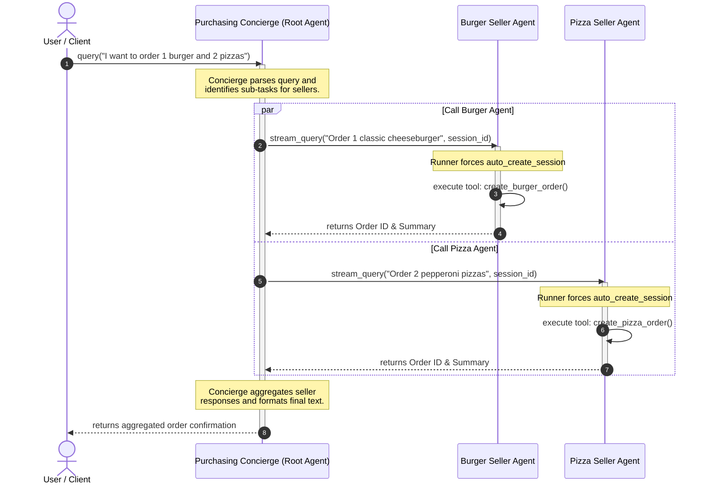

# Multi-Agent Purchasing Concierge on Vertex AI Agent Runtime (ADK)

This project implements a multi-agent purchasing concierge system deployed on **Vertex AI Agent Runtime (Reasoning Engine)** using the Google **Agent Development Kit (ADK)** and **Agent Identity**.

It is adapted from the [A2A Purchasing Concierge Codelab](https://codelabs.developers.google.com/intro-a2a-purchasing-concierge?hl=en#1), shifting the target runtime from Cloud Run to Agent Runtime (Reasoning Engines) for enhanced integration with Google's agent platform and secure multi-agent communication.

## Architecture Overview

The system consists of three independent agents executing on separate Reasoning Engine runtimes:



1.  **Purchasing Concierge (Root Agent)**: Coordinates the purchasing flow. It receives the user's intent, splits the request, programmatically queries the respective seller agents, aggregates their responses, and returns the final order confirmation.
2.  **Burger Seller Agent**: A specialized agent handling queries about the burger menu and executing order creation.
3.  **Pizza Seller Agent**: A specialized agent handling queries about the pizza menu and executing order creation.

---

## Prerequisites

Ensure you have the following before starting:
*   A Google Cloud Project with the Vertex AI API enabled.
*   The `gcloud` CLI installed and authenticated (`gcloud auth login`).
*   [uv](https://github.com/astral-sh/uv) installed for dependency management:
    ```bash
    pip install uv
    ```

---

## Installation & Environment Setup

Clone the repository and sync dependencies using `uv`:

```bash
git clone https://github.com/demichael4520/multiagent-a2a.git
cd multiagent-a2a
uv sync
```

---

## Deployment Sequence

Deployment must follow a strict order because the Root Agent requires the Resource IDs of the Seller Agents at deployment time. You can optionally enable **Agent Identity** (SPIFFE/mTLS managed machine identity) using the `--enable-agent-identity` flag.

### Step 1: Deploy Seller Agents
Run the deployment script to deploy both the Burger and Pizza seller agents:
```bash
uv run python deploy_sellers_adk.py --project=YOUR_PROJECT_ID --enable-agent-identity
```
This script will:
1.  Package and deploy the Burger Agent to Agent Runtime.
2.  Package and deploy the Pizza Agent to Agent Runtime.
3.  Write the deployed Resource IDs to a local file named `seller_agents.env`.

### Step 2: Deploy Purchasing Concierge (Root Agent)
Run the deployment script for the Purchasing Concierge:
```bash
uv run python deploy_concierge_adk.py --project=YOUR_PROJECT_ID --enable-agent-identity
```
This script will:
1.  Read the Seller Agent Resource IDs from `seller_agents.env` and set them as environment variables inside the Concierge's container.
2.  Wrap the Concierge in the Playground compatibility helper.
3.  Deploy the Concierge to Agent Runtime and print its Resource ID.

---

## Querying the Root Agent

### 1. Google Cloud Console Playground (Interactive UI)
1. Go to the [Vertex AI Reasoning Engine Console](https://console.cloud.google.com/vertex-ai/reasoning-engines).
2. Click on the deployed **`purchasing-concierge-adk`** agent.
3. Use the right-hand **Test Agent** panel to chat directly.

### 2. Python SDK
```python
import vertexai
from vertexai.preview.reasoning_engines import ReasoningEngine

vertexai.init(project="ge-test-3p-only-2", location="us-central1")
agent = ReasoningEngine("YOUR_CONCIERGE_RESOURCE_ID")

response = agent.query(
    input="I want to order 1 classic cheeseburger and 2 pepperoni pizzas.",
    user_id="customer_1"
)
print(response.get("output"))
```

### 3. REST API via curl
To send a prompt using the REST API from your terminal, execute the following commands:

```bash
# 1. Get an authentication token
TOKEN=$(gcloud auth print-access-token)

# 2. Make the POST call to the query endpoint
curl -X POST \
  -H "Authorization: Bearer $TOKEN" \
  -H "Content-Type: application/json" \
  https://us-central1-aiplatform.googleapis.com/v1beta1/projects/YOUR_PROJECT_ID/locations/us-central1/reasoningEngines/YOUR_CONCIERGE_RESOURCE_ID:query \
  -d '{
    "input": {
      "input": "I want to order 1 classic cheeseburger and 2 pepperoni pizzas.",
      "user_id": "terminal_user"
    }
  }'
```
