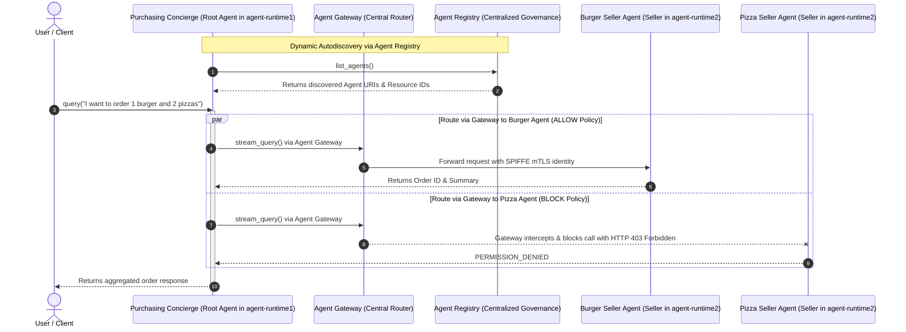

# Multi-Agent Purchasing Concierge on Agent Runtime (ADK)

This project implements a secure, multi-agent purchasing concierge system deployed on **Vertex AI Agent Runtime (Reasoning Engines)** using the Google **Agent Development Kit (ADK)** and **Agent Identity / Agent Gateway**.

It demonstrates **A2A (Agent-to-Agent) Multi-Runtime Orchestration** with **Dynamic Autodiscovery via Agent Registry**, allowing coordinating root agents to discover and delegate tasks to specialist agents across isolated Reasoning Engine runtimes.

---

## Architecture & Multi-Runtime Flow



---

## Key Features & Best Practices

### 1. Decoupled Multi-Runtime Isolation
Root orchestrators (`agent-runtime1`) and specialist seller agents (`agent-runtime2`) execute in separate Reasoning Engine containers on Vertex AI Agent Runtime, ensuring clean architectural boundaries and independent scalability.

### 2. Dynamic Autodiscovery via Agent Registry
Think of the **Agent Registry** as a **Corporate Directory** for AI agents.
When your main manager agent (the **Purchasing Concierge**) wakes up:
* **The Challenge**: It needs to know who its team members are (**Burger Seller Agent** and **Pizza Seller Agent**) and what their direct extension numbers (Reasoning Engine resource IDs) are, without hardcoding them.
* **How ADK Helps**: The **Agent Development Kit (ADK)** provides a built-in phone book lookup tool (`AgentRegistry`).
* **The Lookup**: The Concierge asks Google Cloud: *"Hey, who is registered in my project/governance registry?"*
* **The Response**: The directory replies with a list of agents, their names (`burger_seller_agent`, `pizza_seller_agent`), and their cloud addresses.
* **Ready for Action**: The Concierge saves these addresses so that whenever a customer asks for a burger or pizza, it immediately knows exactly who to call.

### 3. Agent Cards (`AgentCard`): Subagent Profiles
Before an agent can be discovered in the Agent Registry or communicated with via A2A protocols, it publishes an **Agent Card** (`AgentCard`). An Agent Card acts as the digital business card or resume of a subagent, defining:
* **Identity**: Name and version (`name="burger_seller_agent"`, `version="1.0.0"`).
* **Description**: What the agent does (so the LLM knows when to delegate to it).
* **Capabilities & Skills**: Specific tools and actions supported (e.g., `create_burger_order`).
* **Endpoint URL**: Where the agent is hosted (`url=...`).

### 4. How Autodiscovery Works in Code
Inside `purchasing_agent.py`, the `before_agent_callback` hook queries the regional Agent Registry upon initialization:

```python
from google.adk.integrations.agent_registry import AgentRegistry

registry = AgentRegistry(project_id=project, location=location)
response = registry.list_agents()

for agent in response.get("agents", []):
    display_name = agent.get("displayName")
    runtime_ref = agent.get("adkAgentDefinition", {}).get("provisionedReasoningEngine", {}).get("reasoningEngine")

    stream_url = None
    for proto in agent.get("protocols", []):
        for iface in proto.get("interfaces", []):
            if "streamQuery" in iface.get("url", ""):
                stream_url = iface.get("url")

    if display_name and runtime_ref:
        if "burger" in display_name.lower():
            self.agent_ids["burger_seller_agent"] = runtime_ref
            self.agent_urls["burger_seller_agent"] = stream_url
        elif "pizza" in display_name.lower():
            self.agent_ids["pizza_seller_agent"] = runtime_ref
            self.agent_urls["pizza_seller_agent"] = stream_url
```

This guarantees that if specialist agent endpoints are redeployed or scaled, the purchasing concierge automatically resolves their latest resource identifiers without requiring manual code updates.

### 5. Secure Machine Identity (`AGENT_IDENTITY`) & Agent Gateway Routing
Both the **Seller Agents** and the **Purchasing Concierge** enforce zero-trust multi-agent communication by routing all inter-agent calls through the user-supplied **Agent Gateway** using SPIFFE/mTLS managed machine identities.

#### Summary of IAM Permissions and Roles Used
| Role / Permission | Target Resource | Principal / Subject | Purpose |
| :--- | :--- | :--- | :--- |
| `roles/iap.egressor` | Agent Registry Agent Resource (`--agent`) | Agent SPIFFE Principals | Permits the Agent Gateway to egress traffic and pass authentication tokens securely across IAP boundaries to agent runtimes. |
| `roles/aiplatform.agentContextEditor` | Reasoning Engines | Agent SPIFFE Principals | Allows agents to invoke, query, and pass conversation context. |
| `roles/aiplatform.viewer` | Reasoning Engines | Agent SPIFFE Principals | Allows reading reasoning engine resource metadata and health status. |
| `aiplatform.reasoningEngines.query` / `streamQuery` | Reasoning Engine Runtimes | Authenticated Agent Principals | Enables execution of reasoning engine methods. |

---

## Prerequisites

Before deploying and running multi-agent workflows, ensure the following prerequisites are set up in your GCP environment:

1. **Google Cloud Project & CLI**: Google Cloud Projects with Vertex AI API enabled and `gcloud` installed and authenticated (`gcloud auth login`).
2. **Python & uv**: [uv](https://github.com/astral-sh/uv) installed for fast Python dependency management.
3. **Agent Gateway**: An active Agent Gateway configured in your target region (e.g. named via `--gateway-name` or `${GATEWAY_NAME}`).
4. **Core Google APIs Endpoint Service Registration**: Register core Google APIs and services in the Agent Registry so that agents can route requests securely:

```bash
export REGION="us-central1"
export GOOGLE_CLOUD_PROJECT_GOVERNANCE="centralized-governance-project"

gcloud agent-registry services create core-gapi-services \
  --project=${GOOGLE_CLOUD_PROJECT_GOVERNANCE} \
  --location=${REGION} \
  --display-name="gapi.core.services" \
  --description="core apis and services" \
  --endpoint-spec-type=no-spec \
  --interfaces=protocolBinding=JSONRPC,url=https://telemetry.googleapis.com \
  --interfaces=protocolBinding=JSONRPC,url=https://telemetry.mtls.googleapis.com \
  --interfaces=protocolBinding=JSONRPC,url=https://${REGION}-aiplatform.googleapis.com \
  --interfaces=protocolBinding=JSONRPC,url=https://${REGION}-aiplatform.mtls.googleapis.com \
  --interfaces=protocolBinding=JSONRPC,url=https://cloudresourcemanager.googleapis.com \
  --interfaces=protocolBinding=JSONRPC,url=https://iamcredentials.googleapis.com \
  --interfaces=protocolBinding=JSONRPC,url=https://iamcredentials.mtls.googleapis.com \
  --interfaces=protocolBinding=JSONRPC,url=https://agentregistry.googleapis.com
```

---

## Installation & Setup

Clone the repository and sync dependencies:

```bash
git clone https://github.com/demichael4520/cross-project-multiagent.git
cd cross-project-multiagent
uv sync
```

---

## Deployment Guide (Agent Gateway Routing)

Both the seller agents and the purchasing concierge are deployed with Agent Identity and configured to route all inter-agent requests through the **Agent Gateway**.

Export your GCP configuration variables:
```bash
export GOOGLE_CLOUD_PROJECT_GOVERNANCE="centralized-governance-project"
export GOOGLE_CLOUD_PROJECT_CONCIERGE="agent-runtime1"
export GOOGLE_CLOUD_PROJECT_SELLERS="agent-runtime2"
export REGION="us-central1"
export GATEWAY_NAME="centralized-agw"
```

### Step 1: Deploy Seller Agents
Deploy both the Burger and Pizza seller agents to `agent-runtime2`, binding them to the Agent Gateway and Agent Identity:
```bash
uv run python deploy_sellers_adk.py \
  --project=$GOOGLE_CLOUD_PROJECT_SELLERS \
  --region=$REGION \
  --gateway-name=$GATEWAY_NAME \
  --gateway-project=$GOOGLE_CLOUD_PROJECT_GOVERNANCE
```

### Step 2: Deploy Purchasing Concierge (Root Agent)
Deploy the root orchestrator to `agent-runtime1`, configuring it with the same Agent Gateway for secure A2A egress routing and Agent Registry autodiscovery capabilities:
```bash
uv run python deploy_concierge_adk.py \
  --project=$GOOGLE_CLOUD_PROJECT_CONCIERGE \
  --region=$REGION \
  --gateway-name=$GATEWAY_NAME \
  --gateway-project=$GOOGLE_CLOUD_PROJECT_GOVERNANCE
```

### Step 3: Register Agents in Agent Registry
Register all three agents in the centralized Agent Registry:
```bash
# Burger Seller Agent
gcloud agent-registry services create burger-seller-agent \
  --project=$GOOGLE_CLOUD_PROJECT_GOVERNANCE \
  --location=$REGION \
  --display-name="Burger Seller Agent" \
  --agent-spec-type=no-spec \
  --interfaces="protocolBinding=JSONRPC,url=https://${REGION}-aiplatform.mtls.googleapis.com/v1/projects/${PROJECT_NUMBER_SELLERS}/locations/${REGION}/reasoningEngines/${BURGER_ENGINE_ID}"

# Pizza Seller Agent
gcloud agent-registry services create pizza-seller-agent \
  --project=$GOOGLE_CLOUD_PROJECT_GOVERNANCE \
  --location=$REGION \
  --display-name="Pizza Seller Agent" \
  --agent-spec-type=no-spec \
  --interfaces="protocolBinding=JSONRPC,url=https://${REGION}-aiplatform.mtls.googleapis.com/v1/projects/${PROJECT_NUMBER_SELLERS}/locations/${REGION}/reasoningEngines/${PIZZA_ENGINE_ID}"

# Purchasing Concierge ADK
gcloud agent-registry services create purchasing-concierge-adk \
  --project=$GOOGLE_CLOUD_PROJECT_GOVERNANCE \
  --location=$REGION \
  --display-name="Purchasing Concierge ADK" \
  --agent-spec-type=no-spec \
  --interfaces="protocolBinding=JSONRPC,url=https://${REGION}-aiplatform.mtls.googleapis.com/v1/projects/${PROJECT_NUMBER_CONCIERGE}/locations/${REGION}/reasoningEngines/${CONCIERGE_ENGINE_ID}"
```

---

## Testing & Validation via curl (REST API)

To dynamically resolve your deployed Reasoning Engine IDs without hardcoding them, query the Vertex AI Reasoning Engines REST API using `curl` and `jq`:

```bash
export TOKEN=$(gcloud auth print-access-token)
export PROJECT_ID="agent-runtime1"
export REGION="us-central1"

# Fetch reasoning engine ID
export CONCIERGE_ENGINE_ID=$(gcloud aiplatform reasoning-engines list \
  --project=$PROJECT_ID \
  --region=$REGION \
  --filter="displayName:purchasing-concierge-adk" \
  --format="value(name)" | awk -F'/' '{print $NF}')

echo "CONCIERGE_ENGINE_ID=$CONCIERGE_ENGINE_ID"
```

### Validate Purchasing Concierge
```bash
curl -X POST \
  -H "Authorization: Bearer $TOKEN" \
  -H "Content-Type: application/json" \
  https://$REGION-aiplatform.googleapis.com/v1beta1/projects/$PROJECT_ID/locations/$REGION/reasoningEngines/$CONCIERGE_ENGINE_ID:query \
  -d '{
    "input": {
      "input": "I want to order 1 classic cheeseburger.",
      "user_id": "terminal_user"
    }
  }'
```

---

## Cleanup & Resource Teardown

### Purging Stale Deployments
You can purge stale Reasoning Engine deployments at any time by running:
```bash
uv run python cleanup_old_deployments.py --project=$GOOGLE_CLOUD_PROJECT_CONCIERGE --region=$REGION
uv run python cleanup_old_deployments.py --project=$GOOGLE_CLOUD_PROJECT_SELLERS --region=$REGION
```
