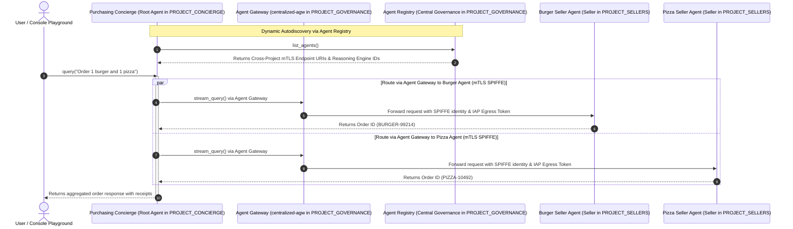

# Multi-Agent Purchasing Concierge on Agent Runtime (ADK)

This project implements a secure, cross-project multi-agent purchasing concierge system deployed on **Vertex AI Agent Runtime (Reasoning Engines)** using the Google **Agent Development Kit (ADK)**, **Agent Identity**, and **Agent Gateway**.

It demonstrates **A2A (Agent-to-Agent) Multi-Runtime Orchestration** with **Dynamic Autodiscovery via Agent Registry**, allowing a root orchestrator agent in a dedicated concierge project to discover and delegate tasks to specialist agents hosted in separate spoke projects across isolated Reasoning Engine runtimes.

> [!NOTE]
> **Environment Reference Project Mapping (3-Project Setup)**:
> - **Central Governance Project (`PROJECT_GOVERNANCE`)**: `centralized-governance-project` — Hosts the Central Agent Gateway (`centralized-agw`), Agent Registry, Identity-Aware Proxy (IAP), and Authorization Policies.
> - **Concierge Runtime Project (`PROJECT_CONCIERGE`)**: `agent-runtime1` — Hosts the Purchasing Concierge Root Orchestrator Agent.
> - **Sellers Runtime Project (`PROJECT_SELLERS`)**: `agent-runtime2` — Hosts the Burger Seller Agent and Pizza Seller Agent.
> - **Region**: `us-central1`

---

## Architecture & Multi-Runtime Flow



---

## Key Features & Best Practices

### 1. Decoupled Multi-Runtime & Package Isolation
Root orchestrators (`PROJECT_CONCIERGE`) and specialist seller agents (`PROJECT_SELLERS`) execute in separate Reasoning Engine containers on Vertex AI Agent Runtime. Each agent is packaged in an isolated subpackage directory (`burger_pkg` and `pizza_pkg`) to prevent Python `cloudpickle` namespace collisions across sibling runtimes.

### 2. Dynamic Autodiscovery via Agent Registry & Cross-Project URLs
The **Purchasing Concierge** dynamically discovers registered seller agents at runtime via the regional **Agent Registry** in `PROJECT_GOVERNANCE`.
- Service URLs in the Agent Registry point across project boundaries using numeric project numbers:
  `https://${REGION}-aiplatform.mtls.googleapis.com/v1/projects/${PROJECT_NUMBER_SELLERS}/locations/${REGION}/reasoningEngines/${BURGER_ENGINE_ID}`
- The concierge extracts the target reasoning engine resource path dynamically from the service interfaces at runtime.

### 3. Secure Machine Identity (`AGENT_IDENTITY`) & Agent Gateway Egress
Both the **Seller Agents** and the **Purchasing Concierge** enforce zero-trust multi-agent communication by routing all inter-agent calls through the central **Agent Gateway** (`projects/${PROJECT_GOVERNANCE}/locations/${REGION}/agentGateways/${GATEWAY_NAME}`) in `PROJECT_GOVERNANCE` using SPIFFE/mTLS managed machine identities.

---

## Cross-Project Egress Gateway IAM Configuration

Following the official Google Cloud documentation for [Configuring Cross-Project Egress Gateway Access](https://docs.cloud.google.com/gemini-enterprise-agent-platform/scale/runtime/agent-gateway-runtime-deploy#deploy-an-agent):

### Step 1: Create Custom IAM Role in Gateway Project
```bash
gcloud iam roles create ar_agw_cross_project_sa \
  --project=$PROJECT_GOVERNANCE \
  --title="Runtime Agent Gateway Cross-Project SA" \
  --description="Custom role for the cross-project service agent to access Agent Gateway" \
  --permissions="networkservices.agentGateways.get,networkservices.operations.get"
```

### Step 2: Assign Custom Role to Spoke Runtime Service Agents
```bash
# 1. Derive Runtime Service Agent Emails
export CONCIERGE_AI_SA="service-${PROJECT_NUMBER_CONCIERGE}@gcp-sa-aiplatform.iam.gserviceaccount.com"
export SELLERS_AI_SA="service-${PROJECT_NUMBER_SELLERS}@gcp-sa-aiplatform.iam.gserviceaccount.com"

# 2. Grant Custom Role in Gateway Project
gcloud projects add-iam-policy-binding $PROJECT_GOVERNANCE \
  --member="serviceAccount:${CONCIERGE_AI_SA}" \
  --role="projects/${PROJECT_GOVERNANCE}/roles/ar_agw_cross_project_sa"

gcloud projects add-iam-policy-binding $PROJECT_GOVERNANCE \
  --member="serviceAccount:${SELLERS_AI_SA}" \
  --role="projects/${PROJECT_GOVERNANCE}/roles/ar_agw_cross_project_sa"
```

---

## Summary of IAM Permissions and Roles Used

| Role / Permission | Target Resource | Principal / Subject | Purpose |
| :--- | :--- | :--- | :--- |
| `ar_agw_cross_project_sa` (Custom Role) | `PROJECT_GOVERNANCE` (`networkservices.agentGateways.get`, `networkservices.operations.get`) | Spoke Project Service Agents (`service-${PROJECT_NUMBER}@gcp-sa-aiplatform.iam.gserviceaccount.com`) | Enables cross-project Agent Gateway lookup and operation status validation during agent runtime deployment. |
| `roles/networkservices.viewer` | `PROJECT_GOVERNANCE` | Spoke Project Service Agents | Predefined alternative containing gateway and operation viewer permissions. |
| `roles/iap.egressor` | Agent Registry Agent Resource (`--agent`) in `PROJECT_GOVERNANCE` | Concierge Engine Principal (`principal://agents.global.org-${ORG_ID}.system.id.goog/...`) | Permits the Agent Gateway to egress traffic and pass authentication tokens securely across IAP boundaries to seller agent runtimes. |
| `roles/aiplatform.user` | Reasoning Engines in `PROJECT_SELLERS` | Concierge Engine Principal & Service Accounts | Grants invocation and user access permissions on spoke reasoning engine runtimes. |
| `roles/agentregistry.viewer` | `PROJECT_GOVERNANCE` | Concierge Service Accounts & PrincipalSet | Enables dynamic auto-discovery of registered agent endpoints from the Agent Registry. |

---

## Deployment Guide (Single Terminal in `PROJECT_GOVERNANCE`)

### Prerequisites
1. GCP Projects (`PROJECT_GOVERNANCE`, `PROJECT_CONCIERGE`, `PROJECT_SELLERS`) with Vertex AI, Agent Registry, and Network Services APIs enabled.
2. `uv` installed for dependency management.
3. Central Agent Gateway created in `PROJECT_GOVERNANCE`.

### Export Configuration Variables
```bash
export PROJECT_GOVERNANCE="centralized-governance-project"
export PROJECT_CONCIERGE="agent-runtime1"
export PROJECT_SELLERS="agent-runtime2"
export REGION="us-central1"
export GATEWAY_NAME="centralized-agw"

export PROJECT_NUMBER_GOVERNANCE=$(gcloud projects describe $PROJECT_GOVERNANCE --format="value(projectNumber)")
export PROJECT_NUMBER_CONCIERGE=$(gcloud projects describe $PROJECT_CONCIERGE --format="value(projectNumber)")
export PROJECT_NUMBER_SELLERS=$(gcloud projects describe $PROJECT_SELLERS --format="value(projectNumber)")
export ORG_ID=$(gcloud projects get-ancestors $PROJECT_GOVERNANCE --format="value(id, type)" | grep organization | awk '{print $1}')
```

### Step 1: Deploy Isolated Seller Agents to Spoke Project
Deploy Burger and Pizza seller agents to `$PROJECT_SELLERS`:
```bash
uv run python deploy_burger.py \
  --project=$PROJECT_SELLERS \
  --region=$REGION \
  --governance-project=$PROJECT_GOVERNANCE \
  --gateway=projects/$PROJECT_GOVERNANCE/locations/$REGION/agentGateways/$GATEWAY_NAME

uv run python deploy_pizza.py \
  --project=$PROJECT_SELLERS \
  --region=$REGION \
  --governance-project=$PROJECT_GOVERNANCE \
  --gateway=projects/$PROJECT_GOVERNANCE/locations/$REGION/agentGateways/$GATEWAY_NAME
```

### Step 2: Deploy Purchasing Concierge to Concierge Project
Deploy the root orchestrator to `$PROJECT_CONCIERGE`:
```bash
uv run python deploy_concierge_adk.py \
  --project=$PROJECT_CONCIERGE \
  --region=$REGION \
  --staging-bucket=gs://$PROJECT_GOVERNANCE-shared-staging \
  --gateway-name=$GATEWAY_NAME \
  --gateway-project=$PROJECT_GOVERNANCE
```

---

## Agent Registry Endpoint Updates & Cross-Project URLs

After deploying reasoning engine instances, register or update the services in `$PROJECT_GOVERNANCE` to point to the spoke reasoning engine endpoints in `$PROJECT_SELLERS`:

```bash
export BURGER_ENGINE_ID=$(gcloud ai reasoning-engines list --project=$PROJECT_SELLERS --region=$REGION --filter="displayName:burger-seller-agent" --format="value(name)" | head -n1 | awk -F'/' '{print $NF}')
export PIZZA_ENGINE_ID=$(gcloud ai reasoning-engines list --project=$PROJECT_SELLERS --region=$REGION --filter="displayName:pizza-seller-agent" --format="value(name)" | head -n1 | awk -F'/' '{print $NF}')
export CONCIERGE_ENGINE_ID=$(gcloud ai reasoning-engines list --project=$PROJECT_CONCIERGE --region=$REGION --filter="displayName:purchasing-concierge-adk" --format="value(name)" | head -n1 | awk -F'/' '{print $NF}')

# Register / Update Burger Seller Agent Service
gcloud alpha agent-registry services update burger-seller-agent \
  --project=$PROJECT_GOVERNANCE \
  --location=$REGION \
  --interfaces="protocolBinding=JSONRPC,url=https://${REGION}-aiplatform.mtls.googleapis.com/v1/projects/${PROJECT_NUMBER_SELLERS}/locations/${REGION}/reasoningEngines/${BURGER_ENGINE_ID}"

# Register / Update Pizza Seller Agent Service
gcloud alpha agent-registry services update pizza-seller-agent \
  --project=$PROJECT_GOVERNANCE \
  --location=$REGION \
  --interfaces="protocolBinding=JSONRPC,url=https://${REGION}-aiplatform.mtls.googleapis.com/v1/projects/${PROJECT_NUMBER_SELLERS}/locations/${REGION}/reasoningEngines/${PIZZA_ENGINE_ID}"

# Register / Update Purchasing Concierge Agent Service
gcloud alpha agent-registry services update purchasing-concierge-adk \
  --project=$PROJECT_GOVERNANCE \
  --location=$REGION \
  --interfaces="protocolBinding=JSONRPC,url=https://${REGION}-aiplatform.mtls.googleapis.com/v1/projects/${PROJECT_NUMBER_CONCIERGE}/locations/${REGION}/reasoningEngines/${CONCIERGE_ENGINE_ID}"
```

---

## Validation of Agent Runtime Route to Agent Gateway

To verify that deployed reasoning engine instances in `$PROJECT_SELLERS` are correctly configured to route inter-agent traffic through the central Agent Gateway in `$PROJECT_GOVERNANCE`, query their deployment specs via `curl`:

```bash
export TOKEN=$(gcloud auth application-default print-access-token)

# Validate Burger Agent Gateway Route
curl -s -X GET "https://${REGION}-aiplatform.googleapis.com/v1beta1/projects/${PROJECT_SELLERS}/locations/${REGION}/reasoningEngines/${BURGER_ENGINE_ID}" \
  -H "Authorization: Bearer ${TOKEN}" \
  -H "Content-Type: application/json" \
  | jq '{displayName: .displayName, effectiveIdentity: .spec.effectiveIdentity, agentGatewayConfig: .spec.deploymentSpec.agentGatewayConfig}'

# Validate Pizza Agent Gateway Route
curl -s -X GET "https://${REGION}-aiplatform.googleapis.com/v1beta1/projects/${PROJECT_SELLERS}/locations/${REGION}/reasoningEngines/${PIZZA_ENGINE_ID}" \
  -H "Authorization: Bearer ${TOKEN}" \
  -H "Content-Type: application/json" \
  | jq '{displayName: .displayName, effectiveIdentity: .spec.effectiveIdentity, agentGatewayConfig: .spec.deploymentSpec.agentGatewayConfig}'
```

**Expected Output**:
```json
{
  "displayName": "burger-seller-agent-adk",
  "effectiveIdentity": "agents.global.org-<ORG_ID>.system.id.goog/resources/aiplatform/projects/<PROJECT_NUMBER_SELLERS>/locations/us-central1/reasoningEngines/<BURGER_ENGINE_ID>",
  "agentGatewayConfig": {
    "agentToAnywhereConfig": {
      "agentGateway": "projects/centralized-governance-project/locations/us-central1/agentGateways/centralized-agw"
    }
  }
}
```

---

## Testing via Google Cloud Console Playground

The deployed agents include the `PlaygroundCompatibleAdkAgent` wrapper, which exposes `register_operations` (`query`, `stream_query`) and parses dictionary payloads sent by the **Google Cloud Console Playground**.

### How to Test in Console UI:
1. Open the [Google Cloud Console](https://console.cloud.google.com/).
2. Navigate to **Vertex AI > Reasoning Engines** in project `$PROJECT_CONCIERGE`.
3. Click on **`purchasing-concierge-adk`**.
4. In the **Playground** chat window on the right side:
   - **Test 1 (Burger - ALLOW)**: Type:
     > *"I confirm ordering 1 Classic Cheeseburger for IDR 85K from burger seller agent. Please place this order now."*
     > **Result**: Returns 200 OK receipt with Order ID.
   - **Test 2 (Pizza - BLOCK)**: Type:
     > *"I confirm ordering 1 Pepperoni Pizza for IDR 140K from pizza seller agent. Please place this order now."*
     > **Result**: Blocked by IAP Default Deny (HTTP 403 Forbidden).
   - **Test 3 (Pizza - Dynamic ALLOW Update)**: Add IAP egress binding for `pizza-seller-agent` in `$PROJECT_GOVERNANCE`:
     ```bash
     export CONCIERGE_SPIFFE_PRINCIPAL="principal://agents.global.org-${ORG_ID}.system.id.goog/resources/aiplatform/projects/${PROJECT_NUMBER_CONCIERGE}/locations/${REGION}/reasoningEngines/${CONCIERGE_ENGINE_ID}"

     gcloud beta iap web add-iam-policy-binding \
       --resource-type=agent-registry \
       --agent=pizza-seller-agent \
       --region=$REGION \
       --project=$PROJECT_GOVERNANCE \
       --role="roles/iap.egressor" \
       --member="$CONCIERGE_SPIFFE_PRINCIPAL"
     ```
     Re-type the pizza order prompt in Playground.
     > **Result**: Returns 200 OK receipt with Order ID immediately without redeploying!

---

## Cloud Logging Validation

Audit inter-agent routing and centralized authorization decisions in `$PROJECT_GOVERNANCE`:

```bash
gcloud logging read \
  'logName="projects/'$PROJECT_GOVERNANCE'/logs/cloudaudit.googleapis.com%2Fdata_access" AND protoPayload.serviceName="iap.googleapis.com"' \
  --project=$PROJECT_GOVERNANCE \
  --limit=10 \
  --format="table(timestamp.date('%Y-%m-%d %H:%M:%S'):label=TIME, protoPayload.authenticationInfo.principalSubject:label=SPIFFE_CALLER, protoPayload.authorizationInfo[0].granted:label=GRANTED, protoPayload.authorizationInfo[0].permission:label=PERMISSION, protoPayload.metadata.dryRun:label=DRY_RUN, protoPayload.status.message:label=STATUS)"
```
