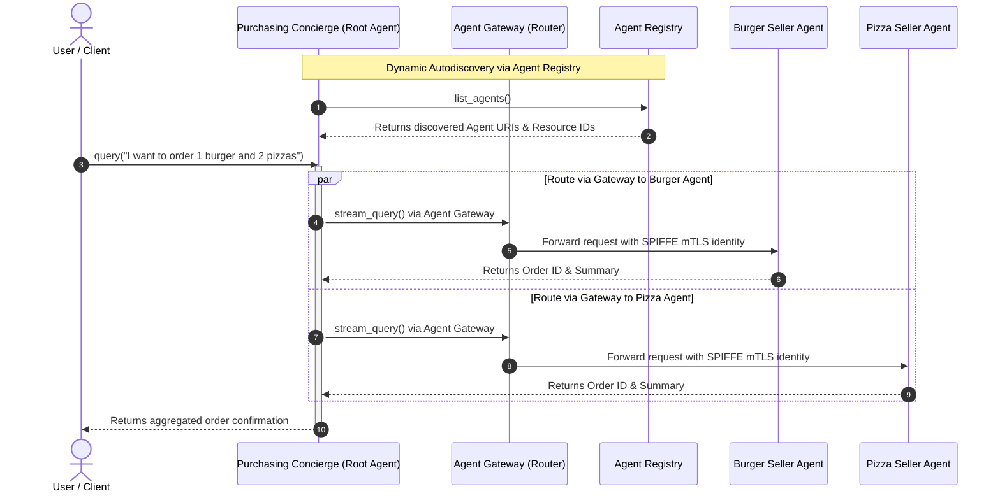

# Multi-Agent Purchasing Concierge on Vertex AI Agent Runtime (ADK)

This project implements a secure, multi-agent purchasing concierge system deployed on **Vertex AI Agent Runtime (Reasoning Engines)** using the Google **Agent Development Kit (ADK)** and **Agent Identity / Agent Gateway**.

It demonstrates **A2A (Agent-to-Agent) Multi-Runtime Orchestration** with **Dynamic Autodiscovery via Agent Registry**, allowing coordinating root agents to discover and delegate tasks to specialist agents across isolated Reasoning Engine runtimes.

---

## Architecture & Multi-Runtime Flow



---

## Key Features & Best Practices

### 1. Decoupled Multi-Runtime Isolation
Root orchestrators and specialist seller agents execute in separate Reasoning Engine containers on Vertex AI Agent Engine, ensuring clean architectural boundaries and independent scalability.

### 2. Dynamic Autodiscovery via Agent Registry (The "Corporate Phone Directory" Analogy)
Think of the **Agent Registry** as a **Corporate Phone Directory** or **Yellow Pages** for AI agents. 
When your main manager agent (the **Purchasing Concierge**) wakes up:
* **The Challenge**: It needs to know who its team members are (the **Burger Seller Agent** and **Pizza Seller Agent**) and what their direct extension numbers (Reasoning Engine resource IDs) are, without hardcoding them.
* **How ADK Helps**: The **Agent Development Kit (ADK)** provides a built-in phone book lookup tool (`AgentRegistry`).
* **The Lookup**: The Concierge asks Google Cloud: *"Hey, who is registered in my project?"*
* **The Response**: The directory replies with a list of agents, their names (`burger_seller_agent`, `pizza_seller_agent`), and their cloud addresses.
* **Ready for Action**: The Concierge saves these addresses so that whenever a customer asks for a burger or pizza, it immediately knows exactly who to call.

### 3. Agent Cards (`AgentCard`): Subagent Profiles
Before an agent can be discovered in the Agent Registry or communicated with via A2A protocols, it publishes an **Agent Card** (`AgentCard`). An Agent Card acts as the digital business card or resume of a subagent, defining:
* **Identity**: Name and version (`name="burger_seller_agent"`, `version="1.0.0"`).
* **Description**: What the agent does (so the LLM knows when to delegate to it).
* **Capabilities & Skills**: Specific tools and actions supported (e.g., `create_burger_order`).
* **Endpoint URL**: Where the agent is hosted (`url=...`).

### 4. Secure Machine Identity (`AGENT_IDENTITY`) & Agent Gateway Routing
Both the **Seller Agents** and the **Purchasing Concierge** enforce zero-trust multi-agent communication by routing all inter-agent calls through the user-supplied **Agent Gateway** using SPIFFE/mTLS managed machine identities.

#### Summary of IAM Permissions and Roles Used
| Role / Permission | Target Resource | Principal / Subject | Purpose |
| :--- | :--- | :--- | :--- |
| `roles/iap.egressor` | Agent Registry Agent Resource | Agent SPIFFE Principals | Permits the Agent Gateway to egress traffic and pass authentication tokens securely across IAP boundaries to agent runtimes. |
| `roles/aiplatform.agentContextEditor` | Reasoning Engines | Agent SPIFFE Principals | Allows agents to invoke, query, and pass conversation context. |
| `roles/aiplatform.viewer` | Reasoning Engines | Agent SPIFFE Principals | Allows reading reasoning engine resource metadata and health status. |
| `aiplatform.reasoningEngines.query` / `streamQuery` | Reasoning Engine Runtimes | Authenticated Agent Principals | Enables execution of reasoning engine methods. |

---

## Prerequisites

Before deploying and running multi-agent workflows, ensure the following prerequisites are set up in your GCP environment:

1. **Google Cloud Project & CLI**: A Google Cloud Project with Vertex AI API enabled and `gcloud` installed and authenticated (`gcloud auth login`).
2. **Python & uv**: [uv](https://github.com/astral-sh/uv) installed for fast Python dependency management.
3. **Agent Gateway**: An active Agent Gateway configured in your target region (e.g. named via `--gateway-name` or `${GATEWAY_NAME}`).
4. **Core Google APIs Endpoint Service Registration**: Register core Google APIs and services in the Agent Registry so that agents can route requests securely:

```bash
export REGION="us-central1"

gcloud agent-registry services create core-gapi-services \
  --location=${REGION} \
  --display-name="gapi.core.services" \
  --description="core apis and services" \
  --endpoint-spec-type=no-spec \
  --interfaces=protocolBinding=JSONRPC,url=https://telemetry.googleapis.com \
  --interfaces=protocolBinding=JSONRPC,url=https://telemetry.mtls.googleapis.com \
  --interfaces=protocolBinding=JSONRPC,url=https://${REGION}-aiplatform.googleapis.com \
  --interfaces=protocolBinding=JSONRPC,url=https://${REGION}-aiplatform.mtls.googleapis.com \
  --interfaces=protocolBinding=JSONRPC,url=https://cloudresourcemanager.googleapis.com \
  --interfaces=protocolBinding=JSONRPC,url=https://iamcredentials.googleapis.com \
  --interfaces=protocolBinding=JSONRPC,url=https://iamcredentials.mtls.googleapis.com \
  --interfaces=protocolBinding=JSONRPC,url=https://agentregistry.googleapis.com
```

---

## Installation & Setup

Clone the repository and sync dependencies:

```bash
git clone https://github.com/demichael4520/multiagent-a2a.git
cd multiagent-a2a
uv sync
```

---

## Deployment Guide (Agent Gateway Routing)

Both the seller agents and the purchasing concierge are deployed with Agent Identity and configured to route all inter-agent requests through the **Agent Gateway**. You can specify a custom Agent Gateway via the `--gateway-name` flag (defaulting to `megatron`).

Export your GCP configuration variables:
```bash
export PROJECT_ID="your-gcp-project-id"
export REGION="us-central1"
export GATEWAY_NAME="megatron"
```

### Step 1: Deploy Seller Agents
Deploy both the Burger and Pizza seller agents to Agent Runtime, binding them to the Agent Gateway and Agent Identity:
```bash
uv run python deploy_sellers_adk.py \
  --project=$PROJECT_ID \
  --region=$REGION \
  --gateway-name=$GATEWAY_NAME
```
This script deploys the specialist agents, configures their Agent Gateway routing, and saves their resource references to `seller_agents.env`.

### Step 2: Deploy Purchasing Concierge (Root Agent)
Deploy the root orchestrator, configuring it with the same Agent Gateway for secure A2A egress routing and Agent Registry autodiscovery capabilities:
```bash
uv run python deploy_concierge_adk.py \
  --project=$PROJECT_ID \
  --region=$REGION \
  --gateway-name=$GATEWAY_NAME
```

---

## How Autodiscovery Works with Agent Registry

Inside `purchasing_agent.py`, the `before_agent_callback` hook queries the regional Agent Registry upon initialization:

```python
from google.adk.integrations.agent_registry import AgentRegistry

registry = AgentRegistry(project_id=project, location=location)
response = registry.list_agents()

for agent in response.get("agents", []):
    display_name = agent.get("displayName")
    runtime_ref = agent.get("adkAgentDefinition", {}).get("provisionedReasoningEngine", {}).get("reasoningEngine")
    # Dynamically maps display names and reasoning engine resource IDs
```

This guarantees that if specialist agent endpoints are redeployed or scaled, the purchasing concierge automatically resolves their latest resource identifiers without requiring manual code updates.

---

## Testing & Validation via curl (REST API)

> **Why use `curl` (or SDK scripts) instead of the Cloud Console Web Playground?**
> * **Multi-Agent A2A Orchestration**: The Web Playground is designed for single-agent exploratory testing, whereas multi-agent architectures require multi-runtime context and session propagation across isolated containers.
> * **Precise Payload & Schema Control**: Direct `curl` requests provide exact control over structured JSON payloads (nested `input`, `message`, `user_id`, and `session_id`), avoiding `400 Bad Request` schema validation errors from generic web UI framing.
> * **IAM, IAP, & Authentication Context**: CLI and REST requests execute using Application Default Credentials (ADC) or OAuth tokens (`gcloud auth print-access-token`), completely bypassing browser CORS policies, corporate proxy limits, or Identity-Aware Proxy (IAP) UI blocks.
> * **Automation & CI/CD Readiness**: REST endpoints and `curl` commands can be seamlessly embedded into automated test suites and CI/CD pipelines.

To dynamically resolve your deployed Reasoning Engine IDs without hardcoding them, query the Vertex AI Reasoning Engines REST API using `curl` and `jq`:

```bash
export TOKEN=$(gcloud auth print-access-token)
export PROJECT_ID="your-gcp-project-id"
export REGION="us-central1"

# Fetch reasoning engines metadata JSON
ENGINES_JSON=$(curl -s -X GET \
  -H "Authorization: Bearer $TOKEN" \
  "https://$REGION-aiplatform.googleapis.com/v1beta1/projects/$PROJECT_ID/locations/$REGION/reasoningEngines")

# Extract Engine IDs dynamically
export CONCIERGE_ENGINE_ID=$(echo $ENGINES_JSON | jq -r '.reasoningEngines[] | select(.displayName=="purchasing-concierge-adk") | .name' | awk -F'/' '{print $NF}' | head -n 1)
export BURGER_ENGINE_ID=$(echo $ENGINES_JSON | jq -r '.reasoningEngines[] | select(.displayName=="burger-seller-agent-adk") | .name' | awk -F'/' '{print $NF}' | head -n 1)
export PIZZA_ENGINE_ID=$(echo $ENGINES_JSON | jq -r '.reasoningEngines[] | select(.displayName=="pizza-seller-agent-adk") | .name' | awk -F'/' '{print $NF}' | head -n 1)

echo "CONCIERGE_ENGINE_ID=$CONCIERGE_ENGINE_ID"
echo "BURGER_ENGINE_ID=$BURGER_ENGINE_ID"
echo "PIZZA_ENGINE_ID=$PIZZA_ENGINE_ID"
```

#### Example Output:
```text
CONCIERGE_ENGINE_ID=7831884546567045120
BURGER_ENGINE_ID=6363711068044263424
PIZZA_ENGINE_ID=5174760766418452480
```

### 1. Validate Purchasing Concierge (Root Agent)
```bash
curl -X POST \
  -H "Authorization: Bearer $TOKEN" \
  -H "Content-Type: application/json" \
  https://$REGION-aiplatform.googleapis.com/v1beta1/projects/$PROJECT_ID/locations/$REGION/reasoningEngines/$CONCIERGE_ENGINE_ID:query \
  -d '{
    "input": {
      "input": "I want to order 1 classic cheeseburger and 2 pepperoni pizzas.",
      "user_id": "terminal_user"
    }
  }'
```

### 2. Validate Burger Seller Agent (Subagent)
```bash
curl -X POST \
  -H "Authorization: Bearer $TOKEN" \
  -H "Content-Type: application/json" \
  https://$REGION-aiplatform.googleapis.com/v1beta1/projects/$PROJECT_ID/locations/$REGION/reasoningEngines/$BURGER_ENGINE_ID:query \
  -d '{
    "input": {
      "message": "I want to order 1 cheeseburger",
      "user_id": "test_user"
    }
  }'
```

### 3. Validate Pizza Seller Agent (Subagent)
```bash
curl -X POST \
  -H "Authorization: Bearer $TOKEN" \
  -H "Content-Type: application/json" \
  https://$REGION-aiplatform.googleapis.com/v1beta1/projects/$PROJECT_ID/locations/$REGION/reasoningEngines/$PIZZA_ENGINE_ID:query \
  -d '{
    "input": {
      "message": "I want to order 1 pepperoni pizza",
      "user_id": "test_user"
    }
  }'
```

---

## Cleanup & Resource Teardown (GAPIC Force-Deletion)

### Why GAPIC Force-Deletion is Required
When iterating on Reasoning Engines on Vertex AI Agent Engine, agents accumulate active child sessions, conversation memory, and execution bindings. 
* **The Limitation**: Standard high-level Python SDK deletion (`ReasoningEngine.delete()`) checks for active child dependencies. If any attached sessions or child resources exist, the API rejects deletion with a **`400 Bad Request`** error.
* **The Solution**: GAPIC force-deletion (`DeleteReasoningEngineRequest(force=True)` via `ReasoningEngineServiceClient`) bypasses high-level wrappers and instructs the Vertex AI control plane to **forcefully cascade-terminate all attached child sessions and dependent runtime states** alongside the Reasoning Engine container. This prevents quota exhaustion and abandoned container runtimes.

### What the Cleanup Script Deletes vs. Preserves (`cleanup_old_deployments.py`)
* **Preserved**: The **single most recent (latest)** deployment for each core agent (`purchasing-concierge-adk`, `burger-seller-agent-adk`, `pizza-seller-agent-adk`).
* **Purged**: 
  1. Older stale iterations and previous duplicate versions of those core agents.
  2. Any unrecognized Reasoning Engines in the project and region whose display names do not match the core agent names.

### Automated & Manual Cleanup Execution
1. **Automatic**: Both deployment scripts (`deploy_sellers_adk.py` and `deploy_concierge_adk.py`) automatically invoke `cleanup_old_deployments.py` prior to provisioning new engines.
2. **Manual Teardown**: You can purge stale Reasoning Engine deployments at any time by running:
   ```bash
   uv run python cleanup_old_deployments.py --project=$PROJECT_ID --region=$REGION
   ```
