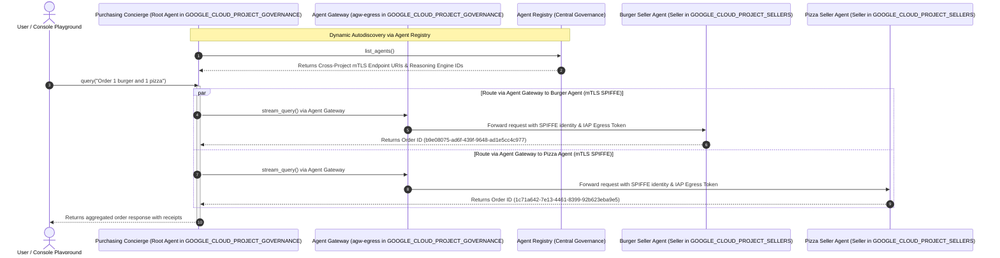

# Multi-Agent Purchasing Concierge on Agent Runtime (ADK)

This project implements a secure, cross-project multi-agent purchasing concierge system deployed on **Vertex AI Agent Runtime (Reasoning Engines)** using the Google **Agent Development Kit (ADK)**, **Agent Identity**, and **Agent Gateway**.

It demonstrates **A2A (Agent-to-Agent) Multi-Runtime Orchestration** with **Dynamic Autodiscovery via Agent Registry**, allowing a root orchestrator agent in a central governance project to discover and delegate tasks to specialist agents hosted in separate spoke projects across isolated Reasoning Engine runtimes.

> [!NOTE]
> **Environment Reference Project Mapping**:
> - **Governance / Central Gateway Project (`GOOGLE_CLOUD_PROJECT_GOVERNANCE`)**: `deepakmichaelprod` (Project Number: `114740196141`)
> - **Seller Spoke Project (`GOOGLE_CLOUD_PROJECT_SELLERS`)**: `deepakmichaelstage` (Project Number: `439077346891`)
> - **Region**: `us-central1`

---

## Architecture & Multi-Runtime Flow



---

## Key Features & Best Practices

### 1. Decoupled Multi-Runtime & Package Isolation
Root orchestrators (`GOOGLE_CLOUD_PROJECT_GOVERNANCE`) and specialist seller agents (`GOOGLE_CLOUD_PROJECT_SELLERS`) execute in separate Reasoning Engine containers on Vertex AI Agent Runtime. Each agent is packaged in an isolated subpackage directory (`burger_pkg` and `pizza_pkg`) to prevent Python `cloudpickle` namespace collisions across sibling runtimes.

### 2. Dynamic Autodiscovery via Agent Registry & Cross-Project URLs
The **Purchasing Concierge** dynamically discovers registered seller agents at runtime via the regional **Agent Registry**.
- Service URLs in the Agent Registry point across project boundaries:
  `https://us-central1-aiplatform.mtls.googleapis.com/v1/projects/439077346891/locations/us-central1/reasoningEngines/<ENGINE_ID>`
- The concierge parses numeric project numbers (e.g., `439077346891`) back to their GCP project IDs (`deepakmichaelstage`) dynamically.

### 3. Secure Machine Identity (`AGENT_IDENTITY`) & Agent Gateway Egress
Both the **Seller Agents** and the **Purchasing Concierge** enforce zero-trust multi-agent communication by routing all inter-agent calls through the central **Agent Gateway** (`projects/deepakmichaelprod/locations/us-central1/agentGateways/agw-egress`) using SPIFFE/mTLS managed machine identities.

---

## Summary of IAM Permissions and Roles Used

| Role / Permission | Target Resource | Principal / Subject | Purpose |
| :--- | :--- | :--- | :--- |
| `ar_agw_cross_project_sa` (Custom Role) | Gateway Project (`networkservices.agentGateways.get`, `networkservices.operations.get`) | Spoke Project Service Agents | Enables cross-project Agent Gateway lookup and operation status validation. |
| `roles/networkservices.viewer` | Gateway Project | Spoke Project Service Agents | Allows viewing network service objects across projects. |
| `roles/iap.egressor` | Agent Registry Agent Resource (`--agent`) | Concierge Engine Principal (`principal://agents.global.org-1015654926499...`) | Permits the Agent Gateway to egress traffic and pass authentication tokens securely across IAP boundaries to seller agent runtimes. |
| `roles/aiplatform.user` | Reasoning Engines (Spoke Runtimes) | Concierge Engine Principal & Service Accounts | Grants invocation and user access permissions on spoke reasoning engine runtimes. |
| `roles/agentregistry.viewer` | Governance/Gateway Project | Concierge Service Accounts & PrincipalSet | Enables dynamic auto-discovery of registered agent endpoints from the Agent Registry. |
| `roles/aiplatform.agentContextEditor` | Reasoning Engines | Agent SPIFFE Principals | Allows agents to invoke, query, and pass conversation context. |

---

## Deployment Guide

### Prerequisites
1. GCP Projects with Vertex AI, Agent Registry, and Network Services APIs enabled.
2. `uv` installed for dependency management.
3. Central Agent Gateway created in the Governance project.

### Export Configuration Variables
```bash
export GOOGLE_CLOUD_PROJECT_GOVERNANCE="deepakmichaelprod"
export GOOGLE_CLOUD_PROJECT_SELLERS="deepakmichaelstage"
export REGION="us-central1"
export GATEWAY_NAME="agw-egress"
```

### Step 1: Deploy Isolated Seller Agents to Spoke Project
Deploy Burger and Pizza seller agents to `$GOOGLE_CLOUD_PROJECT_SELLERS` (`deepakmichaelstage`):
```bash
uv run python deploy_burger.py \
  --project=$GOOGLE_CLOUD_PROJECT_SELLERS \
  --region=$REGION \
  --governance-project=$GOOGLE_CLOUD_PROJECT_GOVERNANCE \
  --gateway=projects/$GOOGLE_CLOUD_PROJECT_GOVERNANCE/locations/$REGION/agentGateways/$GATEWAY_NAME

uv run python deploy_pizza.py \
  --project=$GOOGLE_CLOUD_PROJECT_SELLERS \
  --region=$REGION \
  --governance-project=$GOOGLE_CLOUD_PROJECT_GOVERNANCE \
  --gateway=projects/$GOOGLE_CLOUD_PROJECT_GOVERNANCE/locations/$REGION/agentGateways/$GATEWAY_NAME
```

### Step 2: Deploy Purchasing Concierge to Governance Project
Deploy the root orchestrator to `$GOOGLE_CLOUD_PROJECT_GOVERNANCE` (`deepakmichaelprod`):
```bash
uv run python deploy_concierge_adk.py \
  --project=$GOOGLE_CLOUD_PROJECT_GOVERNANCE \
  --region=$REGION \
  --staging-bucket=gs://$GOOGLE_CLOUD_PROJECT_GOVERNANCE-shared-staging \
  --gateway-name=$GATEWAY_NAME \
  --gateway-project=$GOOGLE_CLOUD_PROJECT_GOVERNANCE
```

---

## Agent Registry Endpoint Updates & Cross-Project URLs

After deploying new reasoning engine instances, update the registered Agent Registry services in `$GOOGLE_CLOUD_PROJECT_GOVERNANCE` (`deepakmichaelprod`) to point to the new spoke reasoning engine endpoints in `$GOOGLE_CLOUD_PROJECT_SELLERS` (`deepakmichaelstage`, Project Number `439077346891`):

```bash
export SELLERS_PROJECT_NUMBER=$(gcloud projects describe $GOOGLE_CLOUD_PROJECT_SELLERS --format="value(projectNumber)")
export BURGER_ENGINE_ID="2715395147641651200"
export PIZZA_ENGINE_ID="5638231305805103104"

# Update Burger Seller Agent Service
gcloud alpha agent-registry services update burger-seller-agent \
  --project=$GOOGLE_CLOUD_PROJECT_GOVERNANCE \
  --location=$REGION \
  --interfaces="protocolBinding=JSONRPC,url=https://${REGION}-aiplatform.mtls.googleapis.com/v1/projects/${SELLERS_PROJECT_NUMBER}/locations/${REGION}/reasoningEngines/${BURGER_ENGINE_ID}"

# Update Pizza Seller Agent Service
gcloud alpha agent-registry services update pizza-seller-agent \
  --project=$GOOGLE_CLOUD_PROJECT_GOVERNANCE \
  --location=$REGION \
  --interfaces="protocolBinding=JSONRPC,url=https://${REGION}-aiplatform.mtls.googleapis.com/v1/projects/${SELLERS_PROJECT_NUMBER}/locations/${REGION}/reasoningEngines/${PIZZA_ENGINE_ID}"
```

---

## Validation of Agent Runtime Route to Agent Gateway

To verify that deployed reasoning engine instances are correctly configured to route inter-agent traffic through the central Agent Gateway, query their deployment specs via `curl`:

```bash
export TOKEN=$(gcloud auth application-default print-access-token)
export BURGER_ENGINE_ID="2715395147641651200"
export PIZZA_ENGINE_ID="5638231305805103104"

# Validate Burger Agent Gateway Route
curl -s -X GET "https://${REGION}-aiplatform.googleapis.com/v1beta1/projects/${GOOGLE_CLOUD_PROJECT_SELLERS}/locations/${REGION}/reasoningEngines/${BURGER_ENGINE_ID}" \
  -H "Authorization: Bearer ${TOKEN}" \
  -H "Content-Type: application/json" \
  | jq '{displayName: .displayName, effectiveIdentity: .spec.effectiveIdentity, agentGatewayConfig: .spec.deploymentSpec.agentGatewayConfig}'

# Validate Pizza Agent Gateway Route
curl -s -X GET "https://${REGION}-aiplatform.googleapis.com/v1beta1/projects/${GOOGLE_CLOUD_PROJECT_SELLERS}/locations/${REGION}/reasoningEngines/${PIZZA_ENGINE_ID}" \
  -H "Authorization: Bearer ${TOKEN}" \
  -H "Content-Type: application/json" \
  | jq '{displayName: .displayName, effectiveIdentity: .spec.effectiveIdentity, agentGatewayConfig: .spec.deploymentSpec.agentGatewayConfig}'
```

**Expected Output**:
```json
{
  "displayName": "burger-seller-agent-adk",
  "effectiveIdentity": "agents.global.org-1015654926499.system.id.goog/resources/aiplatform/projects/439077346891/locations/us-central1/reasoningEngines/2715395147641651200",
  "agentGatewayConfig": {
    "agentToAnywhereConfig": {
      "agentGateway": "projects/deepakmichaelprod/locations/us-central1/agentGateways/agw-egress"
    }
  }
}
```

---

## Testing via Google Cloud Console Playground

The deployed agents include the `PlaygroundCompatibleAdkAgent` wrapper, which exposes `register_operations` (`query`, `stream_query`) and parses dictionary payloads sent by the **Google Cloud Console Playground**.

### How to Test in Console UI:
1. Open the [Google Cloud Console](https://console.cloud.google.com/).
2. Navigate to **Vertex AI > Reasoning Engines** in project `$GOOGLE_CLOUD_PROJECT_GOVERNANCE` (`deepakmichaelprod`).
3. Click on **`purchasing-concierge-adk`**.
4. In the **Playground** chat window on the right side, type:
   > *"I confirm ordering 1 Classic Cheeseburger for IDR 85K from burger seller agent and 1 Pepperoni Pizza for IDR 140K from pizza seller agent. Please place both orders now."*
5. The agent will execute the cross-project A2A workflow via Agent Gateway and return full order confirmation receipts (`Order ID`).

### Testing via REST API (`curl`):
```bash
export CONCIERGE_ENGINE_ID="4485309801198256128"

curl -X POST \
  -H "Authorization: Bearer $(gcloud auth application-default print-access-token)" \
  -H "Content-Type: application/json" \
  https://${REGION}-aiplatform.googleapis.com/v1beta1/projects/${GOOGLE_CLOUD_PROJECT_GOVERNANCE}/locations/${REGION}/reasoningEngines/${CONCIERGE_ENGINE_ID}:query \
  -d '{
    "input": {
      "input": "I confirm ordering 1 Classic Cheeseburger for IDR 85K from burger seller agent and 1 Pepperoni Pizza for IDR 140K from pizza seller agent. Please place both orders now.",
      "user_id": "console-tester-user"
    }
  }'
```

---

## Cloud Logging Validation

You can audit inter-agent routing, SPIFFE identity verification, and execution logs across both governance and spoke projects using `gcloud logging read`.

### 1. Governance Project Logs (`$GOOGLE_CLOUD_PROJECT_GOVERNANCE` / `deepakmichaelprod`)
Audit Purchasing Concierge execution and Agent Gateway egress logs:
```bash
# Query Concierge Reasoning Engine Execution Logs
gcloud logging read \
  'resource.type="aiplatform.googleapis.com/ReasoningEngine" AND resource.labels.reasoning_engine_id="4485309801198256128"' \
  --project=$GOOGLE_CLOUD_PROJECT_GOVERNANCE \
  --limit=20 \
  --format="table(timestamp, jsonPayload.message, severity)"

# Query Agent Gateway Routing & Egress Logs
gcloud logging read \
  'resource.type="networkservices.googleapis.com/AgentGateway" OR logName:"logs/networkservices.googleapis.com"' \
  --project=$GOOGLE_CLOUD_PROJECT_GOVERNANCE \
  --limit=20 \
  --format="table(timestamp, jsonPayload.message, severity)"
```

### 2. Spoke Seller Project Logs (`$GOOGLE_CLOUD_PROJECT_SELLERS` / `deepakmichaelstage`)
Audit Burger and Pizza Reasoning Engine execution logs and incoming mTLS SPIFFE requests:
```bash
# Query Burger Seller Agent Execution Logs
gcloud logging read \
  'resource.type="aiplatform.googleapis.com/ReasoningEngine" AND resource.labels.reasoning_engine_id="2715395147641651200"' \
  --project=$GOOGLE_CLOUD_PROJECT_SELLERS \
  --limit=20 \
  --format="table(timestamp, jsonPayload.message, severity)"

# Query Pizza Seller Agent Execution Logs
gcloud logging read \
  'resource.type="aiplatform.googleapis.com/ReasoningEngine" AND resource.labels.reasoning_engine_id="5638231305805103104"' \
  --project=$GOOGLE_CLOUD_PROJECT_SELLERS \
  --limit=20 \
  --format="table(timestamp, jsonPayload.message, severity)"
```

---

## Repository Sync & Upload

To push all updated code, isolated packages (`burger_pkg`, `pizza_pkg`), and documentation to GitHub:

```bash
git add README.md deploy_burger.py deploy_pizza.py deploy_concierge_adk.py burger_pkg/ pizza_pkg/ test_concierge_order.py iap_agent_policy.json
git commit -m "Update documentation, cross-project Agent Gateway validation, IAM policies, and isolated packages"
git push origin main
```
