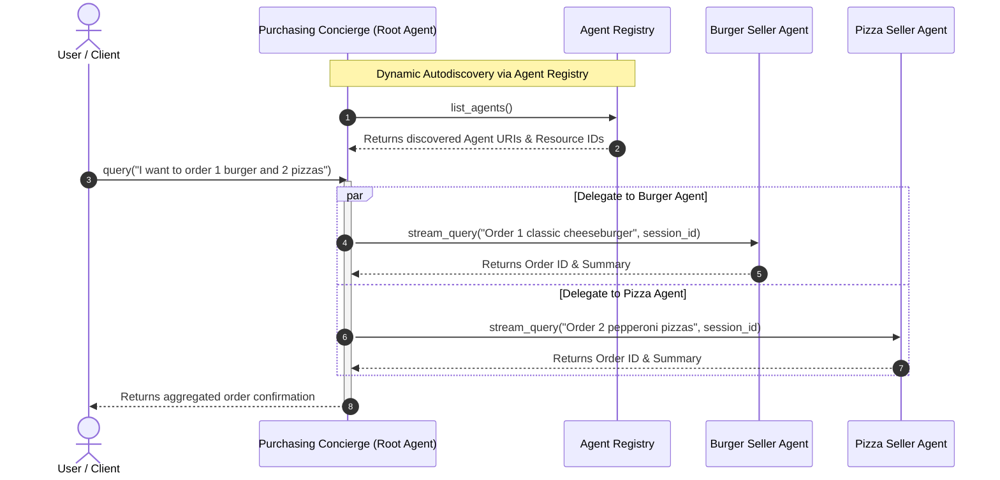

# Multi-Agent Purchasing Concierge on Vertex AI Agent Runtime (ADK)

This project implements a secure, multi-agent purchasing concierge system deployed on **Vertex AI Agent Runtime (Reasoning Engines)** using the Google **Agent Development Kit (ADK)** and **Agent Identity / Agent Gateway**.

It demonstrates **A2A (Agent-to-Agent) Multi-Runtime Orchestration** with **Dynamic Autodiscovery via Agent Registry**, allowing coordinating root agents to discover and delegate tasks to specialist agents across isolated Reasoning Engine runtimes.

---

## Architecture & Multi-Runtime Flow



---

## Key Features & Best Practices

1. **Decoupled Multi-Runtime Isolation**: Root orchestrators and specialist seller agents execute in separate Reasoning Engine containers on Vertex AI Agent Engine.
2. **Dynamic Autodiscovery via Agent Registry**: Instead of relying solely on hardcoded IDs, agents query `google.adk.integrations.agent_registry.AgentRegistry` at runtime to discover deployed agent definitions, protocols, and stream endpoints.
3. **Secure Machine Identity (`AGENT_IDENTITY`) & Agent Gateway**: Integrates SPIFFE/mTLS managed machine identities and Agent Gateway routing for enterprise-grade policy governance and zero-trust multi-agent communication.
4. **Robust Lifecycle & Cleanup**: Includes automated cleanup scripts (`cleanup_old_deployments.py`) using GAPIC force-deletion (`force=True`) to handle attached child sessions and prevent quota exhaustion.

---

## Prerequisites

* A Google Cloud Project with Vertex AI API enabled.
* Google Cloud SDK (`gcloud`) installed and authenticated.
* [uv](https://github.com/astral-sh/uv) installed for fast Python dependency management.

---

## Installation & Setup

Clone the repository and sync dependencies:

```bash
git clone https://github.com/demichael4520/multiagent-a2a.git
cd multiagent-a2a
uv sync
```

---

## Deployment Guide

Export your GCP configuration variables:
```bash
export PROJECT_ID="your-gcp-project-id"
export REGION="us-central1"
```

### Step 1: Deploy Seller Agents
Deploy both the Burger and Pizza seller agents to Agent Runtime with Agent Identity:
```bash
uv run python deploy_sellers_adk.py --project=$PROJECT_ID --region=$REGION
```
This script deploys the specialist agents and saves their resource references to `seller_agents.env`.

### Step 2: Deploy Purchasing Concierge (Root Agent)
Deploy the root orchestrator, configuring it with the Agent Gateway and Agent Registry autodiscovery capabilities:
```bash
uv run python deploy_concierge_adk.py --project=$PROJECT_ID --region=$REGION
```

---

## How Autodiscovery Works with Agent Registry

Inside `purchasing_agent.py`, the `before_agent_callback` hook queries the regional Agent Registry upon initialization:

```python
from google.adk.integrations.agent_registry import AgentRegistry

registry = AgentRegistry(project_id=project, location=location)
response = registry.list_agents()

for agent in response.get("agents", []):
    display_name = agent.get("displayName")
    runtime_ref = agent.get("adkAgentDefinition", {}).get("provisionedReasoningEngine", {}).get("reasoningEngine")
    # Dynamically maps display names and reasoning engine resource IDs
```

This guarantees that if specialist agent endpoints are redeployed or scaled, the purchasing concierge automatically resolves their latest resource identifiers without requiring manual code updates.

---

## Testing & Validation via curl (REST API)

Set your authentication token and deployed resource identifiers:
```bash
export TOKEN=$(gcloud auth print-access-token)
export PROJECT_ID="your-gcp-project-id"
export REGION="us-central1"
export CONCIERGE_ENGINE_ID="your-concierge-engine-id"
export BURGER_ENGINE_ID="your-burger-engine-id"
export PIZZA_ENGINE_ID="your-pizza-engine-id"
```

### 1. Validate Purchasing Concierge (Root Agent)
```bash
curl -X POST \
  -H "Authorization: Bearer $TOKEN" \
  -H "Content-Type: application/json" \
  https://$REGION-aiplatform.googleapis.com/v1beta1/projects/$PROJECT_ID/locations/$REGION/reasoningEngines/$CONCIERGE_ENGINE_ID:query \
  -d '{
    "input": {
      "input": "I want to order 1 classic cheeseburger and 2 pepperoni pizzas.",
      "user_id": "terminal_user"
    }
  }'
```

### 2. Validate Burger Seller Agent (Subagent)
```bash
curl -X POST \
  -H "Authorization: Bearer $TOKEN" \
  -H "Content-Type: application/json" \
  https://$REGION-aiplatform.googleapis.com/v1beta1/projects/$PROJECT_ID/locations/$REGION/reasoningEngines/$BURGER_ENGINE_ID:query \
  -d '{
    "input": {
      "message": "I want to order 1 cheeseburger",
      "user_id": "test_user"
    }
  }'
```

### 3. Validate Pizza Seller Agent (Subagent)
```bash
curl -X POST \
  -H "Authorization: Bearer $TOKEN" \
  -H "Content-Type: application/json" \
  https://$REGION-aiplatform.googleapis.com/v1beta1/projects/$PROJECT_ID/locations/$REGION/reasoningEngines/$PIZZA_ENGINE_ID:query \
  -d '{
    "input": {
      "message": "I want to order 1 pepperoni pizza",
      "user_id": "test_user"
    }
  }'
```
